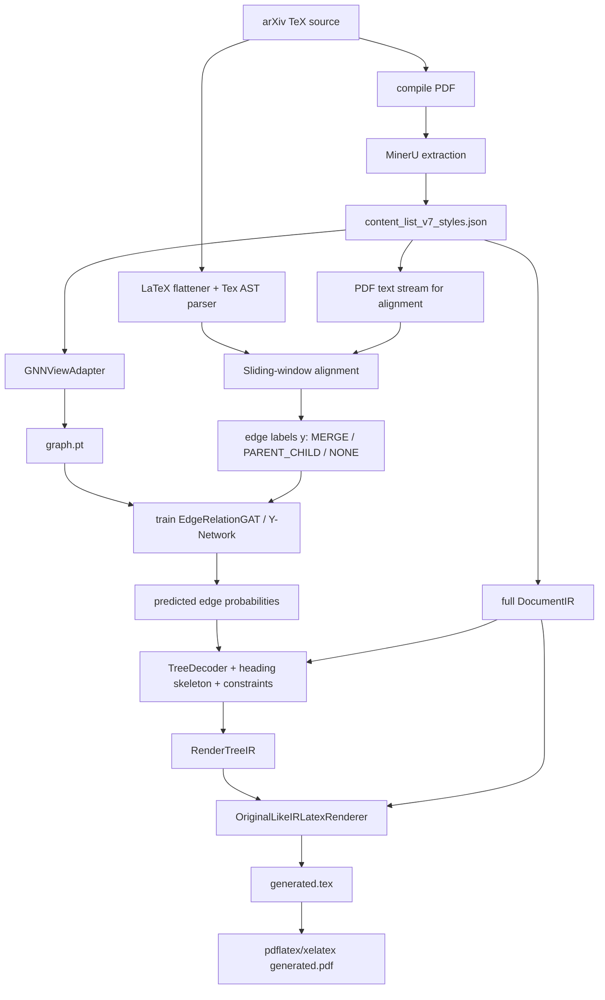
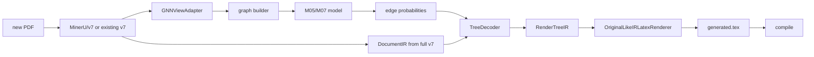

# PDF2LaTeX-NN Full Architecture And Design Notes

**Last updated**: 2026-05-24

This is the full project architecture record. It collects the design decisions,
data flow, judgment rules, model interfaces, evaluation metrics, and code map
that are currently spread across README, schema docs, labeling docs, ablation
notes, and implementation files.

For a paper-facing narrative version of the same architecture, see
`docs/PROJECT_PAPER_DESCRIPTION_2026_05_18.md`.

The repository has two maintained tracks:

1. The default reconstruction track: use MinerU `middle.json` / content-list
   facts, v8 middle reflow, deterministic layout reasoning, heading stack
   decoding, and the full-IR renderer to
   reconstruct compilable, structurally faithful LaTeX.
2. The optional relation-learning track: keep GNN relation experiments for
   diagnostics, ablations, and possible local continuation hints.

The project is not a plain OCR system and not a pure end-to-end language model.
MinerU provides strong PDF perception. This project adds structure reasoning,
relation learning, deterministic safety constraints, and a LaTeX generator.

## 0. Executive Summary

The current maintained reconstruction system is v8 and layout-first.

```text
compiled PDF
  -> MinerU extraction
  -> middle.json + content_list.json
  -> v8 middle reflow / reading-order repair
  -> DocumentIR
  -> front matter extractor
  -> heading style registry + stack skeleton
  -> RenderTreeIR
  -> StyleProfile
  -> OriginalLikeIRLatexRenderer
  -> generated .tex and .pdf
```

The most important architectural split is:

```text
DocumentIR / v8 logical item list = complete fact layer for generation
GNN view                          = filtered/proxied view for optional relation learning
```

Do not delete, rewrite, or mark useful visual facts as noise just because they
are not useful for GNN message passing. Title, authors, figures, tables,
captions, references, footnotes, page furniture, and style spans remain in the
full document fact layer.
When running GNN experiments, the model receives a separate view built by
`GNNViewAdapter`; that view is not the renderer source.

Current production default, 2026-05-24:

```text
scripts/pipeline/run_v8_layout_reconstruction.py
```

These paths use rules-only layout-aware reconstruction by default.  Historical
GNN E2E paths remain available only when explicitly invoked:

```text
scripts/pipeline/batch_visual_qa_inference.py
scripts/pipeline/run_e2e_inference.py
scripts/pipeline/step5_generate_tex.py
scripts/pipeline/run_m05_e2e_comparison.py
```

The v8 path is documented in:

```text
docs/V8_MIDDLE_REFLOW_AND_STYLE_DETECTOR.md
```

Current model/data families:

```text
locked baseline/results:
  tag: v7_registry_adapteraware_20260515_181724
  raw edge_attr_dim: 22
  main checkpoint family: M05/M07 Y-network results
  keep all reports/checkpoints/generated PDFs

active experimental rebuild:
  tag: v7_floatproxy_adapter_20260516_205926
  raw edge_attr_dim: 26
  figure/table/algorithm enter GNN as float proxies
  raw table body / figure OCR do not enter SciBERT text channel
```

## 1. Design Philosophy

### 1.1 What We Let MinerU Do

MinerU is responsible for low-level visual extraction:

- text blocks
- titles
- equations
- tables
- figures/images
- layout boxes
- OCR text
- content list ordering and page coordinates

We do not try to replace MinerU OCR or formula/table detection. The project
assumes MinerU is the perception base and focuses on improving structure,
ordering, relation inference, and LaTeX reconstruction.

### 1.2 What We Do Not Trust Blindly

MinerU output is strong, but not perfect:

- reading order can fail in mixed single/two-column pages
- headers/footers/page numbers can be emitted as normal text
- inline math can be split or OCRed as plain text
- figures/tables can be split into multiple boxes
- captions can be confused with paragraphs
- title and author blocks can pollute column detection

Therefore v7 adds cleanup, style enrichment, layout roles, duplicate/noise
marking, and reading-flow metadata. Still, logical merging is not performed
too early. Cross-page paragraph merging belongs to the decoder/generator.

### 1.3 Why GNN Is Now Optional

The model predicts local graph relations:

```text
MERGE        physical continuation / paragraph stitching
PARENT_CHILD structural attachment / hierarchy
NONE         no structural relation
```

The GNN is not asked to rebuild the whole document alone.  After the
relation-source and middle-fragment audits, its E2E contribution in the current
pipeline is treated as optional rather than production-critical:

- PARENT_CHILD is dominated by the deterministic heading stack and section
  scope logic.
- MERGE can enter RenderTreeIR, but safe useful MERGE labels are sparse and
  noisy under the current v7 logical-owner representation.
- Middle-fragment MERGE learns MinerU line continuation well, but projecting
  those edges back to full-v7 owners did not improve paragraph metrics.

Therefore the default reconstruction path no longer loads a GNN checkpoint.
The GNN branch remains useful for ablation evidence, hard-case diagnostics, and
future local-relation research.

### 1.4 Why We Still Use Rules

Some document facts are better handled deterministically:

- heading parentage should follow a global heading stack
- section scope should follow reading order
- true page furniture should not enter the body graph
- cross-column gutter barriers should block impossible merges
- floats and captions need geometric grouping before rendering
- references and appendix need section-tail policies

The intended split is:

```text
Rules: global outline, hard physical constraints, safety gates
GNN: local continuation and attachment evidence
Renderer: faithful LaTeX surface from full v7 facts
```

Current 2026-05-22 interpretation:

```text
Heading / section scope:
  deterministic heading stack is the primary production authority.
  GNN PARENT_CHILD is a hint/shadow signal unless a separate soft-override
  ablation proves value.

MERGE:
  the main learned-relation surface to improve.
  Accepted MERGE edges can already enter RenderTreeIR and affect generated
  LaTeX; the hard question is label/channel precision, not renderer exposure.

Rules-only:
  must remain an explicit baseline. If rules-only is close on easy documents,
  use GNN-sensitive hardsets and edge-level evidence rather than overstating
  E2E gains.
```

## 2. System Diagram



## 3. Repository Code Map

### 3.1 Perception Layer

```text
src/perception/
```

| File | Responsibility |
| --- | --- |
| `schema.py` | Stable feature schema, block enums, tensor field names. |
| `content_resolver.py` | Bounded resolver for selecting the current full v7 content JSON from explicit MinerU/v7 roots. |
| `reading_order.py` | v7 reading-order metadata, TOC/noise helpers, duplicate continuation handling. |
| `xy_cut.py` | Reading-order sorting helpers and band/column order utilities. |
| `style_spans.py` | PyMuPDF span extraction, style state merging, font/bold/italic/math/code flags. |
| `layout_probes.py` | Layout-role probes such as header/footer/footnote/TOC/front matter. |
| `title_features.py` | Numbering and heading token probes. |
| `gnn_view_adapter.py` | Converts full v7 fact layer into graph-visible GNN view. |

### 3.1.1 Current Merge-Audit Tools

```text
tools/audit/channel_aware_merge_label_audit.py
tools/audit/audit_missing_below_threshold_merge.py
tools/audit/family_specific_merge_calibration.py
tools/audit/probe_merge_visibility.py
```

These tools inspect whether MERGE labels and predictions are usable by
family/channel. They are diagnostic tools; they should not mutate graph tensors,
labels, or decoder behavior unless an explicit experimental flag is passed
elsewhere.

The frontend adapter boundary is specified in
`docs/MINERU_ADAPTER_CONTRACT.md`. As long as a future MinerU version or another
PDF extractor still produces the same `DocumentIR` contract, downstream graph,
decoder, and renderer modules do not need to know which engine produced it.

### 3.2 IR Layer

```text
src/ir/
```

| File | Responsibility |
| --- | --- |
| `schema.py` | Canonical DocumentIR, DocumentNode, RenderTreeIR, RenderRole, metadata. |
| `serialization.py` | IR JSON serialization. |
| `validators.py` | IR validation. |

### 3.3 Adapter Layer

```text
src/adapters/
```

| File | Responsibility |
| --- | --- |
| `mineru_v7_document_ir.py` | Converts full MinerU v7 styled JSON into DocumentIR. |

### 3.4 Reasoning Layer

```text
src/reasoning/
```

| File | Responsibility |
| --- | --- |
| `graph_builder.py` | Builds PyG `Data` from GNN view: node features, edge features, candidate edges, masks. |
| `gnn_model.py` | `FeatureProjector`, `EdgeRelationGAT`, Y-network, message mask, merge gate. |
| `training.py` | Training utilities. |
| `label_generator.py` | AlignmentLabeler and edge label generation. |
| `tex_ast_builder.py` | TeX AST extraction. |
| `latex_flattener.py` | Comment stripping, input/include flattening, bbl injection, macro handling, math masking. |
| `tex_relation_labeler.py` | TeX path relation labeling. |
| `postprocess.py` | TreeDecoder, merge contraction, constraints, relation-to-render tree bridge. |
| `prediction_io.py` | Writes auditable `PredictedRelations` JSON sidecars from raw GNN edge logits/probabilities. |
| `heading_skeleton.py` | Heading evidence and document-local heading style profile. |
| `layout_state_machine.py` | Layout state-machine parsing helpers. |

### 3.5 Generation Layer

```text
src/generation/
```

| File | Responsibility |
| --- | --- |
| `render_surface.py` | Canonical public render entrypoint. |
| `ir_renderer.py` | Original-like IR renderer and document-level rendering logic. |
| `ir_renderers/` | Registry-style role renderers: headings, text, math, figures, tables, lists, references, notes, front matter. |
| `style_profile.py` | Global page/style profile: paper size, margins, columns, fonts, headers/footers. |
| `table_assets.py` | Crop fallback assets for tables/figures, grouping, bbox union, asset paths. |
| `citations.py` | Citation and reference resolution helpers. |
| `front_matter.py` | Title/author/abstract handling helpers. |
| `source_float_layout.py` | Optional source-TeX float placement hints. |
| `font_resolver.py` | Font mapping and fontspec helpers. |
| `latex_helpers.py` | Shared escaping, math, list, float, and algorithm helper functions used by the IR renderer. |
| `latex_renderer.py` | Deprecated standalone tree renderer for historical tests; not the production surface. |

Table extraction/rendering and template/style injection are separate contracts:

```text
docs/TABLE_ENGINE_CONTRACT.md
docs/STYLE_TEMPLATE_CONTRACT.md
```

Those contracts keep future structured table engines and SCI/IEEE-style
templates as replaceable providers around `DocumentIR` and `StyleProfile`,
instead of adding another generator path.

### 3.6 Evaluation Layer

```text
src/evaluation/
tools/
```

| File | Responsibility |
| --- | --- |
| `comparison_structure.py` | Converts LaTeX/Markdown into neutral comparison structure. |
| `structure_metrics.py` | Heading, reading order, paragraph boundary/text coverage, section attachment, references, float-caption metrics. |
| `compile_eval.py` | Compile success evaluation. |
| `visual_qa.py` | Visual QA helpers. |
| `tools/convert_latex_to_comparison.py` | LaTeX to comparison JSON. |
| `tools/convert_markdown_to_comparison.py` | Markdown/Nougat MMD to comparison JSON. |
| `tools/evaluate_comparison_structure.py` | Structure metric CLI. |
| `tools/evaluate_rendered_output.py` | Compile and page-layout similarity CLI. |
| `tools/visualize_graph_labels.py` | Draw bbox and MERGE/PARENT labels on original PDF pages. |
| `tools/profile_candidate_edge_recall.py` | Oracle recall profile for candidate edges. |
| `tools/audit_labeled_manifest.py` | Dataset quality audit. |
| `tools/profile_merge_hard_cases.py` | MERGE hard-case profiling. |

### 3.7 Pipeline Scripts

```text
scripts/pipeline/
```

| Script | Responsibility |
| --- | --- |
| `build_v7_dataset_staged.py` | End-to-end staged data production from source/PDF material. |
| `run_current_v7_rebuild_relabel.sh` | Current rebuild/relabel orchestration over existing v7 JSON. |
| `rebuild_graphs_from_manifest.py` | Rebuild graph `.pt` files from v7 content. |
| `relabel_manifest.py` | Generate labels for a manifest of graph/content/TeX pairs. |
| `train_edge_gnn_full.py` | Full relation model training with CE/Focal/OHEM/threshold calibration options. |
| `prepare_ablation_suite.py` | Generate ablation run commands. |
| `summarize_ablation_results.py` | Summarize ablation outputs. |
| `run_e2e_inference.py` | Batch/single E2E inference into TeX/PDF. |
| `batch_visual_qa_inference.py` | E2E visual QA batch runner. |
| `step5_generate_tex.py` | Single document inference/generation entrypoint. |
| `run_nougat_comparison.py` | Nougat comparison runner. |
| `download_nougat_checkpoint.py` | Nougat checkpoint download helper. |
| `run_current_full_eval_suite.py` | Current paper-facing full evaluation suite: ablation, E2E, Nougat, rollup. |
| `collect_current_eval_results.py` | Read-only collector that produces JSON/CSV/Markdown summaries from completed outputs. |
| `filter_split_manifest.py` | Quality filtering and document-level split helpers. |
| `clean_author_bio_merges_manifest.py` | Manifest cleanup for author biography/backmatter MERGE pollution. |
| `calibrate_edge_thresholds.py` | Validation-set threshold search. |
| `refresh_graph_edges_from_manifest.py` | Refresh edge topology/features without rerunning MinerU. |
| `augment_edge_punctuation_features.py` | Historical punctuation feature augmentation. |

## 4. Data Artifacts And Contracts

### 4.1 Full v7 Fact Layer

File pattern:

```text
content_list_v7_styles.json
```

Purpose:

- complete PDF-side observation layer
- generator input
- source of bboxes, pages, style spans, layout roles, and visual facts

It must preserve:

- body text
- headings
- title/authors/affiliations/abstract
- figures, tables, algorithms, captions
- references
- footnotes, margin notes
- header/footer/page number candidates
- raw bbox and page size
- style spans from PyMuPDF
- layout layer and role metadata

It should not:

- perform cross-page paragraph merging
- drop useful metadata
- relabel figures/tables as noise just because they should not propagate text
- rewrite title/author/front matter for GNN convenience

### 4.2 GNN View

Built by:

```text
src/perception/gnn_view_adapter.py
```

The adapter returns:

```text
gnn_items
gnn_to_v7_index
gnn_to_v7_id
gnn_to_v7_ids
v7_index_to_gnn_idx
v7_id_to_gnn_idx
excluded_items_summary
```

Current policy:

| Source node | GNN view policy | Generator policy |
| --- | --- | --- |
| body text | include | render |
| headings | include if body heading | render via heading skeleton |
| metadata title/authors/affiliation | exclude by default | render via front matter |
| abstract | usually excluded from body GNN | render as abstract/front-matter block |
| header/footer/page number | exclude | use only for global page-style profile |
| footnote/margin note | exclude from body GNN | render through note renderer |
| figure/table/algorithm | include as float proxy in experimental path | render crop fallback or structured surface |
| caption | include as semantic proxy for float when appropriate | render with float |
| raw table body / figure OCR | not embedded as normal text | used for crop/table fallback only |
| TOC | exclude | optionally render table of contents, not body |
| duplicate shadow/no_render | exclude | no render |

### 4.3 Graph `.pt`

The graph file is a PyTorch Geometric `Data` object:

```text
Data(
  x=[N, node_dim],
  edge_index=[2, E],
  edge_attr=[E, edge_dim],
  y=[E],
  message_edge_mask=[E],
  merge_candidate_mask=[E],
  node_records=[N records],
  gnn_to_v7_id=[N],
  gnn_to_v7_ids=[N list],
  v7_source_path=...,
  feature_schema=...,
  edge_attr_schema=...
)
```

Current dimensions:

```text
locked baseline:
  edge_attr_dim = 22

float-proxy experimental path:
  edge_attr_dim = 26
```

Node dimension is produced from schema fields and can change when node feature
groups are added. For the active float-proxy rebuild, observed setup is:

```text
node_dim = 832
edge_dim = 26
```

## 5. V7 Frontend Processing

### 5.1 MinerU Stage

Input:

```text
compiled PDF
```

Output:

```text
MinerU content list / middle outputs
```

MinerU handles OCR/layout/formula/table/figure detection. We keep its output as
the perceptual base.

### 5.2 v7 Conversion And Style Enrichment

Relevant files:

```text
scripts/pipeline/step1_build_content_v7.py
scripts/pipeline/step1_enrich_content_styles.py
src/perception/style_spans.py
src/adapters/mineru_v7_document_ir.py
```

Main enrichment:

- stable node ids
- page and bbox normalization
- reading order and global order metadata
- layout layer and role detection
- PyMuPDF style spans
- font size, bold, italic, inline math, inline code ratios
- list marker probes
- title numbering features
- duplicate-contained continuation detection
- TOC/header/footer/footnote/page number candidates
- float/table/figure grouping metadata

### 5.3 Reading Order

The project explored several ordering strategies. Current production rule is:

```text
v7 keeps reading-flow metadata;
graph features use this flow;
renderer sorts siblings by stable reading order;
global structure may be corrected by heading skeleton and decoder constraints.
```

Important history:

- v2 was closest to raw MinerU output.
- v3/v4/v5 contained experimental paragraph merges and are not production.
- v7 removed premature cross-paragraph merging and focuses on preserving facts.
- Later fixes introduced band/column awareness, state-machine parsing, and
  front-matter/noise separation.

### 5.4 Noise And Metadata

Noise is only true page furniture or duplicates:

- repeated page headers
- repeated page footers
- page numbers
- TOC entries if not needed by body structure
- watermark-like fragments
- duplicate shadows / no-render OCR duplicates

Metadata is not noise:

- paper title
- authors
- affiliations
- emails
- abstract

Metadata is excluded from body GNN by default but remains for generation.

### 5.5 OCR Fragment Cleaning

Common problem:

```text
y p p p g
g()
stray small symbols before a paragraph
```

Current strategy:

- detect extremely short, low-semantic, split-letter fragments near body text
- mark as duplicate_shadow/no_render or exclude from GNN
- keep the raw v7 record for debugging provenance
- do not let such fragments enter generator output

This is a defensive cleanup layer for MinerU OCR edge cases.

## 6. Feature Engineering

### 6.1 Node Feature Groups

Defined in:

```text
src/perception/schema.py
src/reasoning/graph_builder.py
```

Node features concatenate:

```text
SciBERT semantic embedding
type one-hot
geometry anchors
scroll geometry
derived statistics
style statistics
sinusoidal sequence position
column one-hot
title structure probes
layout layer one-hot
flow context features
```

The schema fields:

```text
SCIBERT_DIM = 768

FEATURE_TYPE_VOCAB:
  text, title, equation, table, figure, algorithm, list, code, reference, other

GEOMETRY_FIELDS:
  x_start_local, y_start_page, x_end_local, y_end_page

SCROLL_GEOMETRY_FIELDS:
  norm_width_local
  norm_width_page
  norm_height_font
  norm_pseudo_y
  norm_index

DERIVED_STAT_FIELDS:
  macro_position
  aspect_ratio
  text_density

STYLE_STAT_FIELDS:
  baseline_font_size_norm
  font_size_vs_doc_body
  bold_char_ratio
  italic_char_ratio
  inline_math_char_ratio
  inline_code_char_ratio

SEQUENCE_POSITION_FIELDS:
  16-dimensional sinusoidal reading-order encoding

COLUMN_FEATURE_FIELDS:
  column_left
  column_right
  column_full_or_single

TITLE_STRUCTURE_FIELDS:
  relative_font_size
  is_h1_pattern
  is_h2_pattern

LAYOUT_LAYER_FIELDS:
  main_text_flow
  math_layer
  float_layer
  annotation_layer
  metadata_layer
  noise_layer
  other_layer

FLOW_CONTEXT_FIELDS:
  band_position
  band_local_order
  band_column_left
  band_column_right
  band_column_full
  is_band_boundary
  is_main_flow_candidate
```

### 6.2 SciBERT Handling

Model:

```text
allenai/scibert_scivocab_uncased
```

Raw graph stores the full 768-dimensional embedding. The model-side
`FeatureProjector` applies:

```text
raw SciBERT 768
  -> L2 normalize
  -> Linear(768, 64)
  -> ReLU
  -> Dropout
  -> L2 normalize again
```

Reason:

- reduce semantic dominance over geometry
- reduce topic/domain overfitting
- make the semantic channel structural rather than lexical
- keep relative semantic continuity for edge features

### 6.3 Geometry And Scroll Coordinates

The system uses both local and global geometry:

```text
local x normalization:
  x relative to the current column frame

page width normalization:
  width / physical page width

pseudo-y / scroll-y:
  converts page/column flow into a long vertical scroll coordinate
```

The goal is to reduce the false physical distance between:

```text
left-column bottom -> right-column top
```

and to keep mixed single/two-column pages represented in a more logical
one-dimensional flow.

### 6.4 Edge Feature Groups

Current `EDGE_ATTR_FIELDS`:

```text
semantic_cosine
delta_y_gap
delta_x_left
left_alignment
center_distance
font_size_delta
bold_to_regular
line_height_ratio
y_overlap_ratio
has_x_gutter
index_delta_bin_adjacent
index_delta_bin_skip_one
index_delta_bin_near
index_delta_bin_far
index_delta_bin_reverse
source_ends_with_terminal_punctuation
source_ends_with_hyphen
same_layout_layer
same_layout_band
same_band_column
band_order_delta
crosses_band_boundary
is_float_skip_edge
has_float_between
has_figure_between
has_table_between
```

Important edge feature ideas:

- `semantic_cosine`: continuity in SciBERT space.
- `delta_y_gap`, `delta_x_left`, `center_distance`: physical relation.
- `y_overlap_ratio`, `has_x_gutter`: cross-column barrier.
- index delta bins: sequence relation without overfitting to exact scalar index.
- punctuation probes: whether source ends with terminal punctuation or hyphen.
- layout/band features: local column/band compatibility.
- float skip features: candidate continuation around tables/figures.

### 6.5 Edge Candidate Topology

Candidate edges are built by `build_candidate_edge_pairs`.

Current sources include:

```text
sequential_forced
sequential
spatial_down
spatial_right
same_column_long_sight
float_skip
scope_anchor
list_run_scope
list_intro_scope
```

Key parameters:

```text
sequential_window = 15
spatial_k = 3
long_sight_window = 40
scope_anchor_window = 160
float_skip_window = 40
bidirectional_edges = True
```

Candidate edge recall is a quality gate. If true MERGE/PARENT edges are absent
from `edge_index`, the model cannot learn or predict them.

## 7. GNN View Adapter And Float Proxy Design

### 7.1 Original Problem

Early designs considered excluding figures/tables entirely from GNN input. That
protects text features but creates two problems:

1. Index mapping becomes fragile if graph nodes and v7 nodes diverge too much.
2. Long paragraph continuation across floats loses explicit obstacle context.

### 7.2 Current Experimental Strategy

Figure/table/algorithm nodes enter the graph as float proxies:

```text
float proxy keeps:
  bbox
  page
  order
  type
  v7 mapping

float proxy replaces semantic text with:
  caption text if available
  otherwise [FIGURE] / [TABLE] / [ALGORITHM]
```

Not allowed:

```text
raw table body -> SciBERT paragraph text
raw figure OCR -> paragraph embedding
float node -> normal MERGE with text
float node -> unrestricted message passing into text
```

### 7.3 Masks

Two key masks:

```text
message_edge_mask:
  restricts which edges participate in GAT message passing

merge_candidate_mask:
  blocks MERGE logits for physically/semantically impossible edges
```

The classifier still sees the full candidate edge set. Only propagation and
MERGE eligibility are constrained.

## 8. TeX Truth Generation

### 8.1 Why Labels Are Generated

Training needs ground-truth edge labels. These come from the paired TeX source,
not from manual annotation.

At inference time, TeX is not used. The model only sees PDF-derived graph
features.

### 8.2 TeX Flattening

Implemented in:

```text
src/reasoning/latex_flattener.py
```

Pipeline:

```text
strip comments
recursively expand \input / \include
inject .bbl if available
expand simple zero-argument macros
mask dangerous math environments for parsing when needed
ignore visual-only commands
raise on poison drawing environments when necessary
```

Important rules:

- strip comments first so commented `\input{old}` does not load old source.
- skip visual commands like `\includegraphics`, `\vspace`, `\label`, `\resizebox`.
- unknown wrapper macros are unwrapped when they contain text.
- unknown environments are downgraded to paragraph containers unless poisonous.
- TikZ/PGF-style drawing environments can trigger data drop.

### 8.3 TeX AST Nodes

Supported node types include:

```text
section
paragraph
equation_display
list_container
list_item
figure_caption
table_caption
reference
```

Each node records:

```text
tex_id
node_type
clean_text
parent_id
path_ids
source span
```

Path encoding enables O(1)-style relation checks:

```text
same tex node           -> MERGE candidate
parent path relation    -> PARENT_CHILD
otherwise               -> NONE
```

### 8.4 PDF-to-TeX Alignment

Implemented in:

```text
src/reasoning/label_generator.py
```

Core method:

```text
clean TeX text and PDF text
scan both streams in reading order
use sliding window accumulation
match by fuzzy similarity / Levenshtein-style score
allow equation/float blind alignment with local anchors
write mapping tex_id -> [gnn node indexes]
```

Important alignment policy:

- use the same `GNNViewAdapter` as graph building.
- labels are generated over GNN nodes, not full v7 nodes.
- mapping back to full v7 is preserved for generation.
- metadata/front matter and expected page furniture do not poison orphan rate.
- float nodes are weak/anchor-aligned, not treated as ordinary text paragraphs.

### 8.5 Label Rules

Labels:

```text
MERGE        = 0
PARENT_CHILD = 1
NONE         = 2
```

`SIBLING` is deprecated and folded into `NONE`.

MERGE:

```text
if u and v map to the same TeX node
and types are merge-compatible
and neither endpoint is float/table/figure/equation/code
then MERGE
else not MERGE
```

PARENT_CHILD:

```text
if TeX parent node contains child node
then parent first mapped bbox -> child first mapped bbox is PARENT_CHILD
```

Visual hierarchy fallback:

- when TeX parser cannot represent run-in headings or layout-only headings,
  visual heading hierarchy can provide parent candidates.

Quality gates:

```text
orphan ratio
unmapped TeX ratio
isolated node ratio
candidate edge recall
minimum aligned nodes
section presence
poison layout constructs
```

## 9. Model Architecture

### 9.1 FeatureProjector

Raw graph `x` is not fed directly to GAT. It is projected:

```text
semantic tower:
  768 SciBERT -> L2 -> Linear(64) -> ReLU -> Dropout -> L2

layout tower:
  type + geometry + stats + style + flow -> Linear(32) -> ReLU -> LayerNorm

projected node:
  semantic_64 + layout_32
```

### 9.2 EdgeRelationGAT

The model uses GATv2 layers with edge attributes:

```text
GATv2Conv(..., edge_dim=effective_edge_dim)
```

Message passing can use:

```text
all edges
type-aware message_edge_mask
no message passing
```

### 9.3 Deep Edge Predictor

The edge classifier builds directional pair features:

```text
concat([Hu, Hv, Hu - Hv, Hu * Hv, Euv])
```

This makes PARENT_CHILD anti-symmetric. If `A -> B` is parent-child, `B -> A`
is not automatically parent-child.

### 9.4 Y-Network

The main architectural lesson from ablations:

```text
message passing helps PARENT_CHILD
message passing can pollute MERGE
```

Therefore Y-network separates the heads:

```text
MERGE head:
  raw projected node pair features, bypassing GNN propagation

PARENT/NONE head:
  propagated GAT states
```

This preserves local paragraph boundary evidence for MERGE while letting
PARENT_CHILD benefit from global context.

### 9.5 Hard Merge Gate

Even if the model scores MERGE high, physical gates can suppress the MERGE
logit:

- list bullet barrier
- cross-column gutter barrier
- title/text incompatibility
- float/table/figure/equation incompatibility
- author biography/backmatter exclusions
- causality/order constraints
- excessive distance constraints

### 9.6 Gaussian Edge Feature

M07 adds proximity as an edge feature:

```text
gaussian_proximity = exp(-distance^2 / (2 sigma^2))
```

This is a model-visible cue, not a hard attention kernel. It helps the
propagated branch reason about physical closeness.

## 10. Decoder And Structural Constraints

### 10.1 TreeDecoder Responsibilities

Implemented mainly in:

```text
src/reasoning/postprocess.py
```

Responsibilities:

- read raw edge probabilities from model logits / `predicted_relations.json`
- threshold probabilities
- contract MERGE components
- enforce can_merge barriers
- route predicted GNN edges back to v7 ids
- build heading skeleton if enabled
- restrict relations within section scope
- group references and appendix
- pass full v7 facts to generator

### 10.2 Merge Contraction

MERGE edges form connected components. Each component becomes a supernode:

```text
texts are joined
bboxes are preserved/unioned
source node ids are retained
edge endpoints are rerouted
self loops are removed
```

MERGE is forbidden across:

- section boundaries
- title nodes
- list markers at target
- float/table/figure/equation barriers
- cross-column gutter when boxes overlap in y and have a large x gap
- physically reversed parent/child order where not allowed

### 10.3 Heading Skeleton

The heading skeleton is a decoder prior and safety mechanism around the learned
GNN relation model.  It does not redefine the GNN task and does not replace the
three-class relation prediction design.

Heading stack mode:

```text
collect heading evidence
learn document-local heading style
scan nodes in reading order
maintain active heading stack
provide outline priors and section-scope safety gates
consume GNN MERGE / PARENT_CHILD / NONE probabilities under constraints
```

The `PredictedRelations` sidecar records raw per-edge model output for audit:

```text
edge_logits.pt
  -> predicted_relations.json
     - edge id and source/target graph indices
     - MERGE/PARENT_CHILD/NONE probabilities
     - raw argmax label
     - threshold config
```

Final render structure is not raw argmax. It is produced after merge
contraction, heading-stack scope, relation barriers, and exact graph-to-v7
bridging.

Heading evidence includes:

- MinerU title/type
- layout role
- relative font size
- bold ratio
- isolated line/band boundary
- vertical gaps
- numbering style
- text length
- negative signals for captions, references, footnotes, headers, formulas

Stack rule:

```text
when a heading of level L appears:
  pop stack while top.level >= L
  attach heading to current top
  push heading

non-heading body:
  attach to current active heading
```

This prevents:

- text swallowing headings
- title under paragraph
- subsection as sibling of root when section exists
- cross-page section scope loss

### 10.4 Float And Caption Grouping

Float handling combines:

- v7 float metadata
- bbox proximity
- caption regex
- figure/table number identity
- same-page grouping
- source TeX float layout hints when available

Rules:

- figures/tables are not ordinary paragraphs.
- captions matching `Figure/Fig./Table/Algorithm N` are pulled from body text.
- adjacent figure fragments with same/compatible caption can be grouped.
- subfigure captions are not always reconstructed structurally; large caption is prioritized.
- wide floats use `figure*` / `table*` or temporary single-column behavior.
- small floats stay within the current column if possible.
- `[H]`/placement hardening is used where exact location is more important than LaTeX float freedom.

### 10.5 References And Appendix

References:

- reference items are preserved as list-like bibliography entries.
- original OCR labels such as `[1]` are stripped when generating `\bibitem`.
- if citation resolution exists, markers can become `\cite{...}`.
- reference column mode is inferred from reference item boxes, not just whole
  document mode.

Appendix:

- appendix after references is treated as its own scope.
- column mode is inferred from appendix subtree bboxes.
- single-column and two-column appendices are supported separately from the
  main body and references.

### 10.6 Footnotes And Page Furniture

Header/footer:

- detected statistically across pages
- rendered globally if stable enough
- page numbers use generated counters rather than OCR text where possible

Footnotes/margin notes:

- excluded from body GNN
- retained in full v7
- generator matches anchors by marker or nearest body node
- rendered as `\footnote{...}` or note surface when confidence is adequate

## 11. Generator Architecture

### 11.1 Canonical Renderer

Production entrypoint:

```text
src/generation/render_surface.py
OriginalLikeIRLatexRenderer
```

Low-level LaTeX helper module:

```text
src/generation/latex_helpers.py
```

Deprecated standalone tree renderer:

```text
src/generation/latex_renderer.py
```

The standalone tree renderer is not a production path. Current E2E scripts
expose only:

```text
--renderer ir
```

### 11.2 Registry Renderers

The generator is being split into role-specific renderers:

```text
OriginalLikeIRLatexRenderer
  -> IRRendererRegistry
    -> FrontMatterRenderer
    -> HeadingRenderer
    -> TextRenderer
    -> MathRenderer
    -> FigureRenderer
    -> TableRenderer
    -> ListRenderer
    -> ReferenceRenderer
    -> NoteRenderer
```

Shared data:

```text
RenderContext
DocumentNodeRenderContext
StyleProfile
CitationResolution
CrossReferenceRegistry
```

### 11.3 Global Style Profile

Style profile estimates:

- paper size: A4/letter-like geometry
- margins
- body font size
- title/heading font clusters
- front matter style
- abstract style
- one-column/two-column/mixed layout
- reference column mode
- header/footer/page number style

Important correction:

Column mode should be judged from body text, not author blocks. Author blocks
can look like multi-column but should not force the whole paper into two-column
mode.

### 11.4 Local Rendering Rules

Text:

- render spans with bold/italic/code/math if available
- protect inline LaTeX math
- avoid escaping known LaTeX math commands as plain text
- clean OCR shadows/no-render fragments

Math:

- inline math is protected when span/type evidence exists
- display equations use equation/align/gather/multline fallbacks
- very wide equations use safer environments/width handling
- equation numbers are not fully semantically reconstructed yet

Figures:

- default is crop fallback from original PDF region
- group fragments when needed
- use bbox width ratio to choose column-width vs cross-column rendering
- caption and label generated when available

Tables:

- default is crop fallback for reliable visual reproduction
- group fragments where safe
- wide tables can switch to cross-column/single-column float surface
- internal cell reconstruction is not the current focus

References:

- bibliography environment fallback
- `\bibitem{ref_i}` if no true key
- citation marker replacement when available

Front matter:

- title, authors, affiliation, abstract rendered from full v7 metadata
- author block reconstruction is approximate and style-dependent

## 12. Training Pipeline

### 12.1 Dataset Creation

Production-quality data uses compiled source-PDF pairs:

```text
arXiv source -> compile PDF -> MinerU -> v7 -> graph -> TeX labels
```

Avoid training on mismatched official PDFs and TeX sources from different
arXiv revisions.

### 12.2 Rebuild/Relabel Existing v7

Entry:

```bash
TAG=<new_tag> \
INPUT_MANIFEST=<manifest.json> \
WORKERS=4 \
PYTHON_BIN=/root/miniconda3/envs/pdf2latex/bin/python \
EMBEDDING_DEVICE=cpu \
bash scripts/pipeline/run_current_v7_rebuild_relabel.sh
```

This does not rerun MinerU. It rebuilds graph tensors and labels from existing
v7 content.

### 12.3 Train/Val/Test Split

Split must be document-level:

```text
never page-level split
```

Reason: pages from the same paper share template, fonts, margins, and layout.
Page-level split causes leakage and inflated validation scores.

### 12.4 Loss And Imbalance Handling

NONE dominates. The project tested:

- Cross entropy
- Focal loss
- dynamic negative dropout
- OHEM hard negative mining
- threshold calibration

Current lesson:

- random negative dropout can hurt precision by removing hard negatives
- OHEM is more principled
- validation threshold search is useful but must be reported transparently
- selection metrics should emphasize positive classes, especially MERGE

### 12.5 Thresholds

Default argmax is not always ideal under class imbalance. Calibrated thresholds
can be searched on validation set:

```text
if P(MERGE) > tau_merge -> MERGE
elif P(PARENT_CHILD) > tau_parent -> PARENT_CHILD
else NONE
```

Threshold calibration is not data fabrication if:

- thresholds are selected only on validation data
- locked before test evaluation
- reported in experiment configuration

## 13. Ablation Design

The core ablations test whether each subsystem matters.

Current families include:

| Ablation | Purpose |
| --- | --- |
| full / M05 / M07 | Main model variants. |
| old shared GAT | Compare Y-network against earlier GAT. |
| no message passing | Test whether MERGE prefers local raw features. |
| no type-aware message mask | Test pollution from floats/tables/noise. |
| no v7 reading-flow correction | Test contribution of v7 layout-flow fixes. |
| Raw-MinerU-Flow | Use original MinerU order for flow/index/pseudo-y bins. |
| no SciBERT | Test semantic contribution. |
| no geometry | Test physical layout contribution. |
| no punctuation probes | Test paragraph boundary cues. |
| no Gaussian edge feature | Test proximity feature. |
| float-proxy adapter | Test proxy strategy for figure/table/algorithm. |

Main research hypothesis:

```text
GNN relation reasoning improves document structure, but only when the graph view,
message passing, and decoder constraints prevent visual noise from polluting
paragraph and heading relations.
```

## 14. Evaluation Metrics

### 14.1 Edge-Level Metrics

For model training:

- MERGE precision/recall/F1
- PARENT_CHILD precision/recall/F1
- positive macro F1
- precision-oriented F0.5 variants
- confusion matrix
- class distribution
- candidate edge recall

Do not rely on overall accuracy because NONE dominates.

### 14.2 Label Quality Metrics

For data production:

- raw orphan ratio
- effective orphan ratio
- unmapped TeX ratio
- isolated node ratio
- expected orphan exemption count
- candidate edge recall
- label distribution
- failure reason summary

### 14.3 Structure Comparison Metrics

Neutral comparison structure is defined in:

```text
docs/comparison_structure_v1.md
src/evaluation/comparison_structure.py
src/evaluation/structure_metrics.py
```

Metrics:

```text
heading_tree_accuracy
reading_order_accuracy
strict_block_match
window_matching
paragraph_boundary_f1
paragraph_text_coverage_f1
paragraph_merge_f1  # deprecated compatibility alias; do not report independently
section_attachment_f1
section_attachment_body_no_float_f1
section_attachment_oracle_heading_flow_f1
reference_section_completeness
float_caption_attachment_accuracy
generated_structure_validity
macro_structure_score
```

`strict_block_match` keeps the original one-to-one block view.
`window_matching` and `paragraph_text_coverage_f1` allow one gold paragraph to
match several generated paragraphs, or the reverse, so text coverage is not
confused with paragraph boundary fidelity.  These compare structure and content
coverage, not exact font or raw OCR.

### 14.4 Rendered Output Metrics

For generated PDFs:

- LaTeX compile success
- page count similarity
- ink bbox similarity
- horizontal/vertical density profile similarity
- manual hard-case visual QA

Visual QA focuses on:

- title/authors/abstract
- heading hierarchy
- body column mode
- table/figure/caption grouping
- references
- appendix
- inline/display math
- long-distance MERGE around floats

### 14.5 Nougat Comparison

Nougat outputs Markdown/MMD. We compare through a neutral structure layer:

```text
our LaTeX -> comparison_structure_v1
Nougat MMD -> comparison_structure_v1
gold/source TeX -> comparison_structure_v1
```

We do not claim to beat Nougat on raw OCR or formula recognition. The comparison
should emphasize:

- heading tree
- reading order
- paragraph/list merge boundaries
- section attachment
- references
- float/caption structure where observable
- compile/layout QA for our LaTeX only when applicable

## 15. End-To-End Inference Flow



At inference:

- no TeX source is used
- labels are not generated
- GNN outputs relations on GNN-view indexes
- relation bridge maps back to full v7 ids
- generator consumes full v7 facts

## 16. Current Known Limitations

### 16.1 MinerU/OCR Limitations

- occasional stray OCR fragments
- inline math can be plain text
- figures can be missed or split
- tables can be split
- headers/footers may be detected as body
- reading order can be wrong in difficult mixed layouts

### 16.2 TeX Label Limitations

- unusual macros can defeat AST extraction
- source float position may not match PDF float position
- complex custom section commands may be downgraded
- TikZ/PGF drawing can poison alignment
- author/front-matter layout often differs from source semantics

### 16.3 GNN Limitations

- MERGE is extremely long-tail
- PARENT_CHILD is directional and can be harmed by noisy candidates
- message passing can over-smooth paragraph boundaries
- candidate edge recall is a hard ceiling
- if GNN view and label view diverge, labels become invalid

### 16.4 Generator Limitations

- exact journal-template reproduction is not complete
- table cells are usually crop fallback, not semantic reconstruction
- author blocks are approximate
- figure and table placement is approximate but improving
- equation numbering and align/multline fidelity are not complete
- bibliography keys and author-year styles are fallback unless citation
  resolution succeeds

## 17. When To Rerun What

### 17.1 Need MinerU Rerun

Only when changing:

- OCR backend
- MinerU version/backend
- image/table/formula detection
- PDF input set
- v7 extraction that depends on raw MinerU output not already stored

### 17.2 No MinerU Rerun Needed

Only rebuild/relabel when changing:

- GNNViewAdapter policy
- graph features
- edge topology
- label rules
- TeX alignment quality gates
- model feature schema

### 17.3 No Rebuild/Relabel Needed

Only rerun E2E/generator when changing:

- TreeDecoder constraints
- heading skeleton
- float/caption grouping
- references/appendix rendering
- style profile
- LaTeX renderer
- visual QA scripts

### 17.4 Need Retrain

Retrain when:

- graph tensors change
- edge labels change
- node/edge feature dimensions change
- model architecture changes
- loss/sampling strategy changes

## 18. Current Runbook

### 18.1 Rebuild And Relabel Existing v7

```bash
TAG=v7_floatproxy_adapter_$(date +%Y%m%d_%H%M%S) \
INPUT_MANIFEST=data/00_manifests/v7_layers_epigraph_20260514_0238_trainable_recall98.json \
WORKERS=4 \
PYTHON_BIN=/root/miniconda3/envs/pdf2latex/bin/python \
EMBEDDING_DEVICE=cpu \
bash scripts/pipeline/run_current_v7_rebuild_relabel.sh
```

Monitor:

```bash
tail -f logs/${TAG}_run.log
find data/06_graph_features/${TAG}_graphs -name "*.pt" | wc -l
find data/06_graph_features/${TAG}_labeled_graphs -name "*.pt" | wc -l
```

### 18.2 Audit Labels

```bash
python tools/audit_labeled_manifest.py \
  --manifest data/00_manifests/${TAG}_labeled.json \
  --graph-root data/06_graph_features/${TAG}_labeled_graphs \
  --output data/09_eval_reports/${TAG}_audit.json
```

### 18.3 Candidate Edge Recall

```bash
python tools/profile_candidate_edge_recall.py \
  --manifest data/00_manifests/${TAG}_labeled.json \
  --graph-root data/06_graph_features/${TAG}_labeled_graphs
```

### 18.4 Train

```bash
python scripts/pipeline/train_edge_gnn_full.py \
  --manifest data/00_manifests/${TAG}_labeled.json \
  --graph-root data/06_graph_features/${TAG}_labeled_graphs \
  --output-dir data/09_eval_reports/train_${TAG}
```

### 18.5 E2E Hard Cases

```bash
python scripts/pipeline/batch_visual_qa_inference.py \
  --manifest <hardcase_manifest.json> \
  --checkpoint <best_model.pth> \
  --renderer ir \
  --output-dir local_outputs/final_eval_YYYYMMDD/e2e/<tag>
```

### 18.6 Nougat Comparison

```bash
python scripts/pipeline/run_nougat_comparison.py \
  --manifest <comparison_manifest.json> \
  --limit 20 \
  --output-dir data/09_eval_reports/nougat_smoke_<tag>
```

Then convert outputs:

```bash
python tools/convert_latex_to_comparison.py --input ours.tex --output ours.json
python tools/convert_markdown_to_comparison.py --input nougat.mmd --output nougat.json
python tools/evaluate_comparison_structure.py --gold gold.json --pred ours.json --output ours_metrics.json
python tools/evaluate_comparison_structure.py --gold gold.json --pred nougat.json --output nougat_metrics.json
```

## 19. Code Ownership By Concern

### Data Preparation

- `scripts/pipeline/step0_*`
- `scripts/pipeline/build_v7_dataset_staged.py`
- `scripts/pipeline/run_current_v7_rebuild_relabel.sh`
- `scripts/pipeline/rebuild_graphs_from_manifest.py`
- `scripts/pipeline/relabel_manifest.py`

### Feature Contract

- `src/perception/schema.py`
- `docs/feature_schema_v0.md`
- `src/reasoning/graph_builder.py`
- `tests/test_graph_builder_features.py`

### GNN View Contract

- `src/perception/gnn_view_adapter.py`
- `tests/test_gnn_view_adapter.py`
- `docs/frontend_backend_contract_v1.md`

### Label Contract

- `src/reasoning/label_generator.py`
- `src/reasoning/tex_ast_builder.py`
- `src/reasoning/latex_flattener.py`
- `docs/ground_truth_labeling_v0.md`
- `tests/test_label_generator.py`
- `tests/test_alignment_labeler.py`

### Model Contract

- `src/reasoning/gnn_model.py`
- `scripts/pipeline/train_edge_gnn_full.py`
- `configs/ablation_matrix_v7_adapteraware_20260514_2109.json`
- `tests/test_graph_builder.py`
- `tests/test_v7_training_entrypoints.py`

### Decoder Contract

- `src/reasoning/postprocess.py`
- `src/reasoning/heading_skeleton.py`
- `src/reasoning/layout_state_machine.py`
- `tests/test_postprocess_renderer.py`

### Generator Contract

- `src/generation/render_surface.py`
- `src/generation/ir_renderer.py`
- `src/generation/ir_renderers/`
- `src/generation/style_profile.py`
- `src/generation/table_assets.py`
- `src/generation/citations.py`
- `tests/test_ir_renderer_registry.py`
- `tests/test_generation_style_citations.py`

### Evaluation Contract

- `src/evaluation/comparison_structure.py`
- `src/evaluation/structure_metrics.py`
- `tools/evaluate_comparison_structure.py`
- `tools/evaluate_rendered_output.py`
- `tests/test_structure_metrics.py`
- `tests/test_comparison_structure.py`

## 20. Testing Strategy

Unit tests cover:

- v7 contract rejection of old JSON
- style span merging and font probes
- reading order helpers
- GNN view adapter mapping and exclusion/proxy policy
- graph builder feature dimensions and masks
- label generation and alignment quality
- GNN model architecture and edge heads
- training utilities, OHEM, threshold calibration
- IR schema and renderer registry
- structure comparison metrics
- safe generator behavior

Key tests:

```text
tests/test_gnn_view_adapter.py
tests/test_graph_builder_features.py
tests/test_label_generator.py
tests/test_alignment_labeler.py
tests/test_v7_training_entrypoints.py
tests/test_ir_renderer_registry.py
tests/test_structure_metrics.py
tests/test_comparison_structure.py
```

Remote targeted smoke for current float-proxy changes:

```text
pytest -q tests/test_gnn_view_adapter.py tests/test_graph_builder_features.py
```

## 21. Paper-Writing View

The project can be described as:

```text
A structure-aware PDF-to-LaTeX system that combines a mature document parser
(MinerU), document-local visual/layout features, TeX-derived weak supervision,
and a constrained graph relation model to recover logical document structure
and generate compilable LaTeX.
```

Main contributions:

1. v7 full fact layer plus decoupled GNN view.
2. TeX AST to PDF block alignment for automatic relation labels.
3. Directional edge relation model with Y-network and type-aware propagation.
4. Layout-aware edge features, including scroll-y, band/column context, and
   float-skip features.
5. Deterministic heading skeleton and physical safety constraints.
6. Original-like IR renderer with crop fallback for tables/figures, references,
   citations, notes, mixed-column support, and compile checks.
7. Neutral comparison structure for comparing with Nougat-like Markdown systems.

What to emphasize in experiments:

- relation model improves over heuristics on ambiguous MERGE/PARENT edges
- type-aware propagation prevents float/table pollution
- v7 reading-flow features improve mixed layout behavior
- generator can compile and preserve structure better than plain OCR/Markdown
- comparison focuses on structure, not raw OCR or formula recognition

## 22. Glossary

| Term | Meaning |
| --- | --- |
| v7 | Current full styled MinerU-derived fact layer. |
| GNN view | Filtered/proxied node sequence used for graph tensors. |
| Float proxy | Figure/table/algorithm node represented by caption/placeholder for GNN. |
| MERGE | Same logical text unit split across visual boxes. |
| PARENT_CHILD | Logical hierarchy or attachment relation. |
| NONE | No learned structural relation. |
| Heading skeleton | Deterministic outline prior and safety constraint used together with GNN parent-edge probabilities. |
| RenderTreeIR | Decoder output consumed by IR renderer. |
| Comparison Structure | Neutral structure JSON for comparing our LaTeX with Nougat Markdown. |
| Candidate edge recall | Fraction of true labels present in graph candidate edges. |
| Effective orphan ratio | Orphan ratio after exempting expected non-body visual nodes. |

## 23. Non-Negotiable Rules

1. Do not train on v3/v4/v5 JSON.
2. Do not delete old checkpoints, eval reports, manifests, or E2E outputs.
3. Do not infer current data family from a historical config filename.
4. Do not rerun MinerU unless OCR/bbox/raw extraction changed.
5. Do not let generator consume the reduced GNN view as the full document.
6. Do not use TeX source during inference.
7. Do not page-split train/val/test.
8. Do not report accuracy alone under extreme NONE imbalance.
9. Do not treat metadata and floats as noise in the full v7 fact layer.
10. Do not reintroduce old `--renderer tree` into production E2E scripts.
