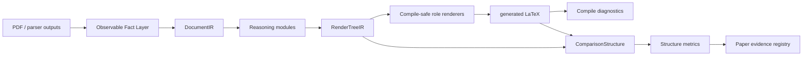

# 项目整理情况与模块协作线路

最后更新：2026-06-01。

本文档用来回答两个问题：

1. 现在 PDF2LaTeX 项目整理成什么样了？
2. 后续开发新论文/新模块时，各模块应该怎么合作？

## 1. 当前仓库状态

GitHub 仓库：

```text
https://github.com/Y1m1ngLuuuuuuuuuuuuuuuuuu/pdf2latex-observable-reconstruction.git
```

当前长期主分支：

```text
main
```

PRCV 论文冻结分支：

```text
prcv-final-freeze-20260530
```

当前状态：

- `main` 已经更新到最新稳定源码。
- `prcv-final-freeze-20260530` 保留为 PRCV 投稿时的可追溯快照。
- 旧的 `codex/v7-frontmatter-rebuild` 临时分支已经被 `main` 覆盖并删除。
- 后续开发不再直接在 PRCV freeze 分支上继续做。

## 2. 当前本地目录分工

源码仓库：

```text
/Users/lu/Code/Project/pdf2latex_nn/pdf2latex-observable-reconstruction
```

旧路径兼容入口：

```text
/Users/lu/Code/Project/pdf2latex_nn/test_4_19
```

它是指向源码仓库的软链接，用来保护旧命令、旧报告和旧上下文。

同级目录分工：

```text
/Users/lu/Code/Project/pdf2latex_nn/
  pdf2latex-observable-reconstruction/   当前源码仓库
  project_process_history/               旧过程报告、诊断、历史 eval reports
  legacy_runtime_materials/              本地遗留运行产物和样例输出
  legacy_reference/                      旧参考材料
  local_envs/                            本地虚拟环境
  private_config_do_not_upload/          私有配置，例如 .env.local
```

论文工作区：

```text
/Users/lu/University/Paper/pdf2latex/PRCV/LaTeX_Reconstruction_zh
```

AutoDL 运行区：

```text
/root/autodl-tmp/pdf2latex_nn
```

网盘备份保存：

- PRCV clean export bundle
- selected2000 相关输入/输出轻量包
- full8000 raw PDFs / MinerU outputs
- extra Nougat runtime package

这些是材料备份，不进入 GitHub source repo。

## 3. 整体项目与论文模块的关系

PDF2LaTeX 是长期项目，不是一篇论文的代码包。PRCV 只是目前已经完成的
一个 paper module。

```text
PDF2LaTeX overall project
  -> stable interfaces
  -> reusable implementation modules
  -> paper module: PRCV 2026 observable reconstruction
  -> future paper modules:
       table semantics
       float-caption grounding
       front-matter linking
       Nougat/API baselines
       relation learning / GNN
       full8000 runtime/material release
```

每篇新论文都应该单独定义：

- 研究问题
- 数据 denominator
- 方法和 baseline
- 证据目录
- 表格来源
- locked numbers
- claim boundary
- 不允许 claim 的内容

不要把未来论文的新结论直接塞进 PRCV evidence registry。

## 4. 当前主线路

当前项目主线路是 observable-fact-guided PDF-to-LaTeX reconstruction：



这个主线路的核心思想是：

- PDF 不等于作者原始 TeX 源码。
- 项目目标不是恢复 source-level TeX AST。
- 项目目标是从 PDF 可观测证据中重建结构合理、可编译、可评价的 LaTeX。
- 结构评价通过 neutral ComparisonStructure 完成。

## 5. 模块之间怎么合作

### 5.1 PathConfig

位置：

```text
src/config/project_paths.py
```

职责：

- 统一解析本地、AutoDL、WSL、paper workspace、report root。
- 避免新代码继续硬编码 `/Users/lu/...` 或 `/root/autodl-tmp/...`。

所有新模块都应该先接入路径配置。

### 5.2 DatasetManifest

位置：

```text
src/datasets/
data/00_manifests/
```

职责：

- 定义一组文档的 doc_id、PDF、parser outputs、gold targets、runtime outputs。
- 锁定每篇论文的 denominator。

论文模块必须先锁 manifest，再谈实验表。

### 5.3 ParserAdapter

位置：

```text
src/adapters/
```

职责：

- 把 MinerU 或其他 parser 输出转成项目内部可用事实。
- 保留 provenance。
- 不因为当前论文暂时不用某类信息就删除它。

### 5.4 Observable Fact Layer

位置：

```text
src/perception/
src/reasoning/*_context_group.py
```

职责：

- 保存 PDF 可观测事实：
  - geometry
  - reading order
  - text/style spans
  - formula evidence
  - caption evidence
  - reference evidence
  - table/front-matter cues
  - page furniture
  - provenance

这是项目的核心资产层。未来论文大多应该从这里扩展，而不是绕过它。

### 5.5 DocumentIR / RenderTreeIR

位置：

```text
src/ir/
src/reasoning/v8_render_tree.py
```

职责：

- `DocumentIR` 表示结构事实。
- `RenderTreeIR` 表示用于渲染的 typed tree。
- 它们是 parser facts 和 LaTeX renderer 之间的接口层。

如果未来做 table semantics、front matter linking 或 algorithm renderer，应优先扩展 IR，
而不是直接在 renderer 里塞临时逻辑。

### 5.6 Reasoning Modules

位置：

```text
src/reasoning/
```

职责：

- heading skeleton
- front matter extraction
- float-caption matching
- formula context grouping
- reference context grouping
- page furniture grouping
- optional relation learning / GNN view

Reasoning module 负责“判断关系”，renderer 负责“安全输出”。两者不要混在一起。

### 5.7 Renderer Plugins

位置：

```text
src/generation/
src/generation/ir_renderers/
```

职责：

- 把 typed roles 渲染成 LaTeX。
- 优先保证 compile-safe degradation。
- 不能因为追求外观相似而破坏 compile safety。

当前稳定渲染方向包括：

- text / headings / lists
- math safe fallback
- reference fallback
- float-caption materialization
- table safe fallback
- front matter rendering

### 5.8 CompileEval

位置：

```text
src/evaluation/compile_eval.py
src/generation/compile_checker.py
```

职责：

- 判断生成 LaTeX 是否编译成功。
- 记录诊断信息。

注意：

- 可以增强日志解码和诊断鲁棒性。
- 不应悄悄改变 compile_success 判定语义。

### 5.9 ComparisonStructure

位置：

```text
src/evaluation/comparison_structure.py
tools/convert_*_comparison.py
tools/evaluate_comparison_structure.py
```

职责：

- 把不同输出合同统一到中立结构表示。
- 允许 Ours、ContentList Direct、MinerU Direct、Nougat/MMD 等做结构评价。

注意：

- Direct parser baseline 不是 LaTeX renderer。
- Nougat/MMD baseline 不是完整 LaTeX renderer。
- compile/visual QA 只适用于完整 LaTeX 输出。

### 5.10 EvidenceRegistry

位置：

```text
data/09_eval_reports/
docs/*EVIDENCE*
```

职责：

- 记录 paper module 的 locked numbers。
- 记录 claim boundary。
- 区分 main claim、controlled baseline、diagnostic-only、deprecated。

PRCV registry 不应承载未来论文的新 claim。

## 6. PRCV 模块现在怎么放

PRCV 模块已经提交，当前角色是：

```text
paper module: PRCV 2026 observable reconstruction
```

证据入口：

```text
data/09_eval_reports/00_PRCV_FINAL_EVIDENCE_20260531/
docs/PRCV_EVIDENCE_REGISTRY_20260531.md
```

PRCV 证据层级：

- selected2000：主规模 direct-parser comparison，n=1972。
- selected200：含 Nougat 的 controlled four-method comparison。
- selected2000 usability：Ours 的 generated/compile/conversion/metrics coverage。

PRCV 不 claim：

- Nougat selected2000 completed
- selected2000 four-method comparison
- selected2000 Ours metrics 2000/2000
- source-level TeX AST recovery
- solved table-cell semantics
- broad Algorithm renderer enabled
- compile/visual QA for parser-output baselines

## 7. 后续开发分支策略

稳定主线：

```text
main
```

PRCV 快照：

```text
prcv-final-freeze-20260530
```

建议新模块分支：

```text
feat/table-semantics
feat/float-caption-grounding
feat/front-matter-linking
feat/nougat-baselines
exp/gnn-relation-learning
paper/<venue>-<topic>
```

开发规则：

1. 从 `main` 开新分支。
2. 先写模块 registry / interface note。
3. 再改代码。
4. 小步提交。
5. 实验输出留在 AutoDL/runtime，不进 Git。
6. paper evidence 只提交 summary-level registry 和 locked tables。

## 8. 新模块开发模板

每个新模块建议先建立一个文档：

```text
docs/modules/<module_name>_PLAN_<date>.md
```

内容包括：

- 模块目标
- 使用哪个接口层
- 输入输出
- 数据 denominator
- baseline
- 指标
- 不允许 claim 的内容
- 运行位置：local / AutoDL / WSL
- 哪些进入 Git
- 哪些进入 netdisk/runtime backup

## 9. 当前最重要的原则

```text
GitHub 保存源码和小型证据摘要。
AutoDL 保存重运行材料。
网盘保存 tar 备份。
本地论文工作区保存 manuscript。
每篇论文有自己的 evidence registry。
核心模块通过稳定接口协作。
```

这就是现在项目继续往后长的骨架。
