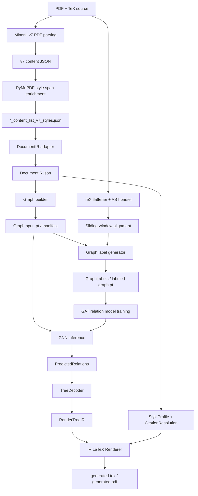

# PDF2LaTeX-NN 项目总览

**Last updated**: 2026-05-11

本文档描述当前项目的整体框架、核心思路、主要实现和后续边界。它面向项目交接、论文方法梳理、实验设计和后续开发，不替代更细的接口文档：

```text
docs/PROJECT_SOURCE_OF_TRUTH.md
docs/frontend_backend_contract_v1.md
docs/feature_schema_v0.md
docs/ground_truth_labeling_v0.md
docs/ablation_plan_v2.md
```

## 1. 项目目标

本项目目标是构建一个面向学术论文 PDF 的神经网络辅助 PDF-to-LaTeX 系统。它不是单纯 OCR，也不是让大模型直接生成整篇 LaTeX，而是把任务拆成几个可控层次：

```text
PDF 中看见的视觉节点
→ 稳定的文档 IR
→ 图结构特征
→ TeX 源码生成真值关系
→ GNN 学习 PDF 节点之间的结构关系
→ Decoder 组装结构树
→ Generator 渲染为 LaTeX
```

系统的核心任务不是“逐像素复刻 PDF”，而是恢复可编辑、可编译、结构尽量正确的 LaTeX。当前首要目标是：

```text
1. 正文阅读顺序正确
2. 标题层级基本正确
3. 跨栏/跨页段落能被合理缝合
4. 公式、列表、引用、参考文献不被普通文本污染
5. 生成 LaTeX 能稳定编译
6. 后端生成逻辑可替换为原文风格、期刊模板或学习到的风格
```

## 2. 核心设计思想

### 2.1 前后端解耦

PDF 前端、TeX 真值生成器、GNN、TreeDecoder 和 LaTeX Generator 不直接互相依赖私有实现，而是通过稳定 IR 交互。

当前跨层稳定对象为：

```text
DocumentIR          PDF 前端输出，描述视觉事实
GraphInput          GNN 输入图和特征引用
GraphLabels         TeX 生成的图边真值
PredictedRelations  GNN 推理输出
RenderTreeIR        Decoder 输出的生成结构树
StyleProfile        渲染风格画像
CitationResolution  引用和参考文献修复结果
```

这样做的原因是：后续如果 MinerU、TeX parser、GNN 或 generator 任意一层升级，只要接口不变，就不需要推翻整条链路。

### 2.2 PDF 前端只描述“看见了什么”

PDF 前端不负责判断真值标签，也不提前合并跨段落内容。当前 v7 路线保留 MinerU 的块粒度和 bbox，只增加：

```text
list marker 识别
TOC/header/footer/noise 标记
局部 band/column 版面信息
阅读流修正 metadata
PyMuPDF style_spans
reference_items 保留
table group metadata
```

跨段落、跨页、跨栏的最终合并放在 Decoder/Generator 阶段处理，而不是在前端 JSON 中不可逆地合并。

### 2.3 关系预测，而不是直接生成 LaTeX

GNN 不直接输出 LaTeX。它只预测 PDF 节点之间的三类关系：

```text
MERGE = 0          物理缝合关系
PARENT_CHILD = 1   逻辑挂载关系
NONE = 2           无关系 / 阻断
```

`SIBLING` 已废弃。兄弟顺序由 v7 reading order 和 renderer 的 `reading_index` 排序恢复。

### 2.4 GNN 负责难以规则化的局部结构

项目中很多东西不应该交给 GNN：

```text
页眉页脚全局复刻 -> StyleProfile + fancyhdr
引用修复 -> CitationResolver
表格默认占位/截图 -> Generator policy
字体字号统计 -> StyleProfile
TOC 过滤 -> 前端 layout role
```

GNN 主要负责那些纯规则不稳定、但视觉/语义/几何共同决定的关系，例如：

```text
一个段落是否被物理切断
标题和正文/图表/公式是否存在挂载关系
局部列表、公式、正文之间是否属于同一结构域
```

### 2.5 生成后端必须可切换

同一个结构树可以对应不同输出风格：

```text
original_like      尽量还原原文版式
journal_template   套用 IEEE/ACM/NeurIPS/Elsevier 等模板
learned_style      从论文簇中学习 StyleProfile 后渲染
```

当前主要实现的是 `original_like` 的第一阶段。

## 3. 总体流水线



## 4. PDF 前端

### 4.1 MinerU v7 内容提取

MinerU 负责底层 PDF 内容识别，包括文本块、标题、公式、表格、图片等基础版面元素。项目统一转向 v7 输出路线：

```text
*_content_list_v7.json
*_content_list_v7_styles.json
```

旧的 v3/v4/v5 结果只保留为历史诊断，不再用于训练、推理或生成。

### 4.2 阅读流与版面层标记

前端不再简单依赖 MinerU 原始顺序，也不再使用全局固定 XY-Cut。当前 v7 思路是先标记页面对象与局部版面上下文：

```text
main_text_flow
math_layer
float_layer
metadata_layer
noise_layer
```

同时记录：

```text
layout_band_id
layout_band_type
layout_band_column
layout_flow_order
column_fix_global_order
is_main_flow_candidate
```

这些字段让后续 graph builder 和 decoder 知道某个节点属于正文、公式、浮动体、目录、页眉页脚还是噪声。

### 4.3 PyMuPDF 样式注入

PyMuPDF 用来从 PDF 中提取底层 span 样式：

```text
text
font_name
font_size
is_bold
is_italic
is_inline_math
is_inline_code
bbox
char_count
```

这些 span 会进入 `DocumentNode.spans`。它们是后续判断字体、字号、粗斜体、上下标、局部代码字体、行内公式的依据。

重要边界：

```text
识别字体不需要安装字体包。
PyMuPDF 读取的是 PDF 内嵌或记录的字体名和 span 属性。
只有生成 LaTeX 时想精确复刻字体，才需要目标机器有对应字体。
```

当前字体策略由 `src/generation/font_resolver.py` 实现：把 PDF font name 规范化为 font class 和安全 fallback，例如：

```text
Times/Nimbus -> TeX Gyre Termes
Helvetica/Arial -> TeX Gyre Heros
Courier/Mono -> TeX Gyre Cursor
Computer Modern/Latin Modern -> Latin Modern
```

默认不启用 `fontspec`，保证 pdfLaTeX 路线稳定。只有显式启用 XeLaTeX/LuaLaTeX 时才写入 `\setmainfont` 等命令。

## 5. DocumentIR

`DocumentIR` 是 PDF 前端的稳定边界，代码定义在：

```text
src/ir/schema.py
src/ir/serialization.py
src/ir/validators.py
src/adapters/mineru_v7_document_ir.py
```

核心字段：

```text
doc_id
source_pdf
pages
nodes
reading_order
provenance
metadata
```

每个 `DocumentNode` 包含：

```text
node_id
node_type
text
page_idx
bboxes
reading_index
raw_type
list_type
spans
children_hint
flags
features
source_refs
metadata
```

`DocumentIR` 只表达 PDF 视觉事实，不包含：

```text
GNN label
prediction logits
training loss
train/val/test split
TeX alignment ground truth
```

## 6. Graph 构建与特征

Graph builder 从 v7 styled JSON / DocumentIR 中构建 PyTorch Geometric 图。当前训练仍以 `.pt` 图文件为主，同时逐步引入 `GraphInput` manifest。

### 6.1 节点特征

节点特征来自多模态融合：

```text
SciBERT 语义向量
节点类型 one-hot
局部/全局几何坐标
长卷轴 pseudo-y / reading index
column-aware features
font size / relative font size
bold / italic / inline math / code style stats
heading pattern probes
density / aspect ratio / width ratio
layout layer / flow context
```

重要原则：

```text
SciBERT 用于提供语义连续性，但不能支配几何和版式特征。
训练模型中通过降维、归一化和 ablation 检查语义特征是否过强。
```

### 6.2 边特征

边特征强调相对关系，而不是绝对坐标：

```text
semantic cosine similarity
delta x / delta y / center distance
y_overlap_ratio
has_x_gutter
font_size_delta
bold transition
line-height ratio
index delta bins
source punctuation probes
source ends with hyphen
edge source type
```

这些特征让模型显式看到：

```text
两个节点是不是同栏相邻
是否存在跨栏 gutter
是否是逆序边
源节点是否以句号/问号/叹号结束
源节点是否以连字符结束
字号是否从标题落到正文
```

### 6.3 候选边

候选边采用召回优先策略。默认包括：

```text
sequential window
spatial k-NN
long-sight edges
scope anchor edges
list-run scope edges
float-skip edges
```

当前重要原则：

```text
如果真值边不在 edge_index 中，GNN 永远无法预测它。
训练前必须用 oracle recall profiler 检查候选边召回。
```

因此 graph builder 宁可给出较多候选边，再让 GNN 和后处理过滤，也不能过早剪掉潜在 MERGE / PARENT_CHILD 边。

## 7. TeX 真值生成器

TeX 侧负责生成训练标签，不修改 PDF 前端节点。

主要模块：

```text
src/reasoning/latex_flattener.py
src/reasoning/tex_ast_builder.py
src/reasoning/label_generator.py
src/reasoning/tex_relation_labeler.py
```

### 7.1 LaTeX 展平

真实 arXiv 源码通常包含：

```text
\input / \include
\bibliography / .bbl
自定义宏
未知环境
图像宏
排版参数
```

当前策略：

```text
先剥离注释
递归展开 input/include
注入 bbl
展开零参宏
屏蔽公式环境
静默丢弃视觉/排版宏参数
未知包裹宏剥壳降级为普通文本
复杂绘图环境触发跳过或熔断
```

### 7.2 AST 解析与展平

TeX parser 输出一维有序 AST 节点：

```text
section
paragraph
equation_display
list_container
list_item
figure_caption
table_caption
reference
```

每个 TeX 节点至少包含：

```text
tex_id
node_type
clean_text
parent_id
path_ids
source_order
```

### 7.3 PDF-TeX 对齐

对齐采用顺序双指针 + 累加滑动窗口：

```text
PDF visual sequence V = [V1, V2, ...]
TeX AST sequence T = [T1, T2, ...]
```

核心逻辑：

```text
对 T_i，累加 V_i, V_i+1, ...
直到清洗文本相似度达到阈值
记录 T_i -> [V_i, ..., V_k]
公式/图表允许基于相对位置进行弱对齐
无法对齐的节点进入质量报告
```

### 7.4 三分类标签

给定 `edge_index` 中的候选边 `u -> v`：

```text
MERGE:
  u 和 v 映射到同一个 TeX 节点，且类型同构。
  文本 + 独立公式不会被打成 MERGE。

PARENT_CHILD:
  TeX 中 parent(T_u) == T_v 或 T_u 是 T_v 的直接父锚点。
  标签严格有向，child -> parent 是 NONE。

NONE:
  其它所有关系。
```

质量门：

```text
PDF orphan ratio 过高 -> 跳过
unmapped TeX ratio 过高 -> 跳过
核心 section 缺失 -> 跳过
候选边召回不足 -> 跳过或修 graph builder
孤立节点比例异常 -> 跳过
```

页眉、页脚、页码、目录、部分 front matter 不直接拉高正文 orphan ratio。

## 8. GNN 关系模型

当前模型是基于 GAT/GATv2 的边关系预测模型，核心文件：

```text
src/reasoning/gnn_model.py
src/reasoning/training.py
scripts/pipeline/train_edge_gnn_full.py
```

输入：

```text
x           节点特征
edge_index  候选边
edge_attr   边特征
y           训练时的三分类边标签
```

输出：

```text
MERGE / PARENT_CHILD / NONE logits
softmax probabilities
threshold-calibrated predicted labels
```

预测头已经从简单 linear 升级为更强的关系头，使用：

```text
Hu
Hv
Hu - Hv
Hu * Hv
Euv
```

这样模型能看到方向性、差异性和边特征，不会把 `parent -> child` 与 `child -> parent` 当成同一件事。

训练注意点：

```text
必须按文档级 train/val/test split，不能按页面随机切分。
NONE 类极多，不能只看 accuracy。
主要看 Macro-F1、MERGE/PARENT recall/precision。
阈值校准、OHEM、负采样、Focal Loss 是处理长尾的实验选项。
```

## 9. Decoder 与结构树

TreeDecoder 把 `PredictedRelations` 转成 `RenderTreeIR`。

当前设计原则：

```text
GNN 给概率，不直接决定最终 LaTeX。
Decoder 负责物理安全约束和结构自洽。
Renderer 负责最终排版。
```

重要后处理：

```text
MERGE contraction
cross-column gutter barrier
causality barrier
list bullet barrier
title skeleton / heading stack
section-local decoding
reference topology handling
semantic title deduplication
maximum spanning arborescence for parent tree
```

但新后端正在逐步把渲染责任从旧 `postprocess.py` 中剥离到 IR renderer，避免 TreeDecoder 同时做结构推理和 LaTeX 排版。

## 10. Generator

新生成后端入口：

```text
src/generation/style_profile.py
src/generation/citations.py
src/generation/ir_renderer.py
src/generation/font_resolver.py
src/generation/table_assets.py
```

输入：

```text
DocumentIR
RenderTreeIR
StyleProfile
CitationResolution
```

输出：

```text
generated.tex
generated.pdf
```

### 10.1 StyleProfile

`StyleProfileExtractor` 统计全局版式：

```text
页面大小
边距
单双栏模式
正文基准字号
标题/正文/参考文献字号簇
字体族与 font class
段落缩进
段落间距
公式上下间距
列表间距
页眉页脚页码
```

字体与字号判断必须来自 `DocumentIR.nodes[].spans`、bbox 和 feature 字段，不根据内容关键词臆造。

### 10.2 局部 span 渲染

Renderer 支持：

```text
bold -> \textbf
italic -> \textit
inline code -> \texttt
inline math -> $...$
font family change -> \textsf / \texttt / \textrm
font size change -> local \fontsize
super/subscript -> 基于 span bbox + 小字号 + 相对基线偏移
```

上标/下标不会凭空猜；旧 JSON 没有 span bbox 时会自动降级。

### 10.3 引用和参考文献

`CitationResolver` 做：

```text
正文 [1] / [1-3] -> \cite{...}
reference label stripping
reference_items 中真实 citation_key 优先
没有真实 key 时降级为 ref_1 / ref_2
\begin{thebibliography}
\bibitem{...}
```

### 10.4 页眉页脚

页眉页脚不逐页 OCR 复写。当前做法：

```text
HEADER_FOOTER 节点进入 StyleProfile 统计
多页重复边缘文本 -> 全局 header/footer
多页数字型边缘节点 -> \thepage
Renderer 生成 fancyhdr
低置信边缘文本只保留为 metadata
```

典型输出：

```latex
\usepackage{fancyhdr}
\pagestyle{fancy}
\fancyhf{}
\fancyhead[C]{...}
\fancyfoot[C]{\thepage}
```

### 10.5 表格和图片

当前表格默认策略是保守占位：

```latex
\begin{table}[H]
\centering
% [TODO_TABLE_RECONSTRUCT: BBOX=..., ID=...]
\caption{...}
\end{table}
```

原因是结构化表格重建需要额外表格识别模块。当前不默认截图表格，避免批量生成占用大量空间。后续可以选择：

```text
PDF crop image fallback
HTML/table_body 转 tabular
CV table structure model
专用表格重建器
```

图片当前类似，默认保留 figure placeholder 与 caption。

### 10.6 脚注

当前没有完整脚注重建。已有弱识别/隔离，但还没有：

```text
BlockType.FOOTNOTE
RenderRole.FOOTNOTE
\footnote / \footnotemark / \footnotetext 渲染
正文上标 marker 与底部 footnote 对齐
```

后续建议把脚注作为 deterministic resolver，而不是 GNN 主任务。

## 11. 数据生产与训练

AutoDL 是重型任务环境：

```text
/root/autodl-tmp/pdf2latex_nn
```

本地主要负责：

```text
代码编辑
小样本检查
文档
GitHub 同步
```

AutoDL 负责：

```text
MinerU 批处理
SciBERT 特征
PyMuPDF 样式注入
graph 构建
label 生成
训练
大规模 QA
```

当前批处理目标是生产足够多的 clean `.pt` 样本。每个样本必须通过：

```text
MinerU v7 输出存在
v7 styles 存在
TeX 源码存在
GraphInput 构建成功
GraphLabels 质量门通过
candidate edge recall 合格
```

## 12. 实验设计

实验不应该只看一个端到端 PDF 视觉结果，也不能只看 edge F1。推荐分层评估：

```text
1. Frontend QA
   bbox、reading_order、layout layer、toc/noise/header/footer 是否正确

2. Label QA
   alignment_dict、MERGE/PARENT 标签、orphan/unmapped、candidate recall

3. GNN QA
   Macro-F1、MERGE/PARENT precision/recall、confusion matrix、threshold calibration

4. Generator QA
   编译成功率、章节结构、引用、公式、列表、参考文献、页眉页脚

5. Visual QA
   原 PDF 与生成 PDF 并排检查 fatal/minor errors
```

Ablation 计划记录在：

```text
docs/ablation_plan_v2.md
configs/ablation_matrix_v2.json
scripts/pipeline/prepare_ablation_suite.py
scripts/pipeline/summarize_ablation_results.py
```

建议 ablation 方向：

```text
无 GNN，仅规则/reading_order
无 SciBERT
无几何特征
无 style/font 特征
无 edge punctuation probes
无 layout layer/band features
不同 predictor head
不同 threshold calibration
```

## 13. 与开源系统对比

可对比对象：

```text
Nougat
Marker / Surya / OCR-oriented pipelines
MinerU 原始 markdown/latex-like 输出
Mathpix Snip/API
GROBID / ScienceBeam 类结构抽取
传统 OCR + heuristic baseline
```

需要注意：很多开源工具目标不是完整 PDF-to-LaTeX。对比时应分任务：

```text
文本识别
公式保真
阅读顺序
章节结构
引用/参考文献
表格/图像处理
LaTeX 可编译率
视觉相似度
人工结构评分
```

Mathpix 可以作为强商业基线，但它的定位更偏 OCR/结构化提取，且 API 成本和闭源因素需要单独说明。

## 14. 当前已完成能力

```text
MinerU v7-based PDF 前端路线
PyMuPDF style span 注入
DocumentIR / GraphInput / GraphLabels / PredictedRelations / RenderTreeIR / StyleProfile 契约
TeX flattener + AST labeler 基础闭环
三分类 GNN 标签体系
GAT/GATv2 edge relation model
候选边召回优先策略
阈值校准和训练脚本
v7-to-IR adapter
StyleProfileExtractor
CitationResolver
OriginalLikeIRLatexRenderer
列表成组、公式保护、算法渲染、表格 placeholder
字体/字号/上下标基于 span 特征的局部渲染
页眉页脚页码的全局 fancyhdr 推断
ablation suite 初版
Nougat baseline 环境骨架
```

## 15. 当前主要未完成项

```text
脚注完整重建
结构化表格转 tabular
图片资产复原和 float placement
更强的 TeX AST parser coverage
更稳定的跨文档大规模质量门
更多 clean .pt 数据
训练后的系统性 ablation
与开源/商业 baseline 的正式评测
journal_template 模式
learned_style 模式
最终论文级可视化指标
```

## 16. 开发原则

后续开发尽量遵守：

```text
1. v7 是当前唯一生产 PDF 前端路线。
2. 不再混用 v3/v4/v5 旧 JSON 作为训练或推理输入。
3. 不在 PDF 前端提前做不可逆跨段合并。
4. 不把页眉页脚逐页写回正文。
5. 不让 Generator 直接读 GNN logits。
6. 不让 GNN 学本该由 deterministic resolver 解决的引用、页码、页眉页脚。
7. 不按 page-level 切分训练/验证/测试。
8. 不用 accuracy 作为主指标。
9. 不在缺少 oracle edge recall 的图上训练。
10. 不为了端到端看起来漂亮而污染训练真值。
```

## 17. 推荐下一步

当前最合理的推进顺序：

```text
1. 等 AutoDL 批量 v7 MinerU / graph / label 生产完成。
2. 验收新 batch：label distribution、orphan/unmapped、candidate recall。
3. 抽样可视化 30 篇，确认 labeler 没有新污染。
4. 用 clean `.pt` 训练当前 GAT 关系模型。
5. 锁定一个 best checkpoint，跑 10-20 篇端到端视觉 QA。
6. 做 ablation，证明 GNN、SciBERT、style features、layout features 的贡献。
7. 再进入后端原文排版重建的第二阶段：表格、脚注、模板化期刊风格。
```

这条路线的关键是：先把结构关系模型和接口稳定下来，再扩展生成质量。否则 generator 会反复替模型和脏数据背锅。
