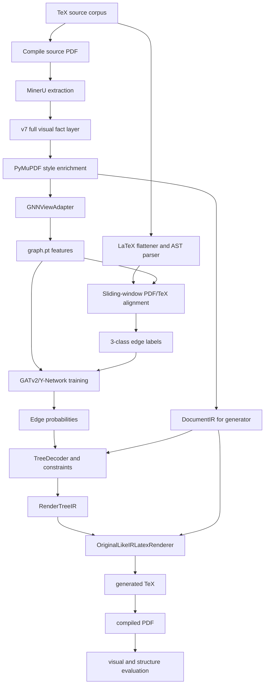

# Project Description For Paper Planning

**Last updated**: 2026-05-18

This document is a paper-facing description of the current system.  It is more
verbose than the source-of-truth runbook because it records the task definition,
architecture, interfaces, modeling choices, generator design, evaluation
protocol, and current experimental tracks in one place.

## 1. Problem Definition

The project targets:

```text
layout-aware, block-structure-preserving, compilable LaTeX reconstruction
from rendered scientific PDFs
```

The project does **not** target:

```text
exact recovery of the author's original TeX source program
```

This distinction is central.  A PDF is a rendered artifact, while TeX is a
program that produced that artifact.  Multiple TeX programs can render to
visually equivalent PDFs.  LaTeX floats can move figures and tables away from
their source locations.  Journal templates can hide author/title/abstract logic
behind macros.  Therefore, source-level AST equivalence is not a fair sole
criterion for a PDF-first system.

The system instead reconstructs a compilable LaTeX document that preserves:

```text
1. block-level semantic organization
2. reading order and paragraph continuity
3. heading hierarchy at section/subsection/subsubsection granularity
4. figure/table/caption/reference structure
5. page-style and layout cues such as columns, margins, font scale, and floats
```

## 2. Main Thesis

MinerU is used as the perception engine.  The contribution of this project is
the structure reasoning and reconstruction layer on top of MinerU:

```text
MinerU gives visual facts.
PyMuPDF enriches style spans.
The TeX-side labeler creates relation supervision.
The GNN predicts uncertain document relations.
The decoder applies physical and structural constraints.
The generator reconstructs compilable, layout-aware LaTeX.
```

The project is therefore neither plain OCR nor a pure language model.  It is a
hybrid symbolic-neural document reconstruction system.

## 3. End-To-End Pipeline



## 4. Layered Architecture

### 4.1 PDF Frontend

The PDF frontend converts PDF perception output into the canonical v7 fact
layer.

Inputs:

```text
compiled PDF
MinerU content/middle outputs
PyMuPDF page and span extraction
```

Outputs:

```text
content_list_v7_styles.json
DocumentIR
GNNViewAdapter records
```

The v7 fact layer keeps all useful observed information:

```text
body text
titles and headings
authors, affiliations, abstract
figures, tables, algorithms, captions
references
footnotes and margin notes
headers, footers, page numbers
OCR text and raw bboxes
style spans and font statistics
layout-layer and role annotations
reading-order metadata
```

Important policy:

```text
"not useful for GNN" does not mean "delete from v7".
```

For example, page headers may be excluded from the GNN, but they are still
available for global page-style profiling.  Figure/table raw OCR may be
excluded from the semantic embedding channel, but the crop and caption remain
available for the generator.

### 4.2 GNN View Adapter

The graph model does not consume the full document.  It consumes a graph-visible
view built by:

```text
src/perception/gnn_view_adapter.py
```

The adapter creates:

```text
gnn_items
gnn_to_v7_id
gnn_to_v7_ids
v7_id_to_gnn_idx
excluded_items_summary
```

This mapping is required for inference.  The generator never renders from the
filtered graph view alone.  It renders from full v7/DocumentIR plus predicted
relations bridged back to v7 ids.

Current float-proxy policy:

```text
figure/table/algorithm are not body text
figure/table/algorithm enter structure view as float proxies
caption or placeholder text represents float semantics
raw table body / figure OCR is not embedded as ordinary paragraph text
MERGE is blocked for float proxies
message passing from float proxies into body text is masked
skip-over-float candidate edges preserve paragraph-continuation recall
```

### 4.3 Graph Builder

`src/reasoning/graph_builder.py` builds PyTorch Geometric `Data` objects.

Current graph components:

```text
x                  node feature tensor
edge_index          directed candidate edges
edge_attr           directed edge features
y                   optional 3-class labels
message_edge_mask   edges allowed in message passing
merge_candidate_mask
gnn_to_v7_id / gnn_to_v7_ids
feature_schema / edge_attr_schema
```

Historical locked baseline:

```text
node_dim = 832
edge_dim = 22
```

Current float-proxy experimental schema:

```text
node_dim = 832
edge_dim = 26
```

The exact feature dimension must be treated as schema-versioned, not hard-coded
in paper claims.  Reports should state the schema tag used for each experiment.

### 4.4 TeX Truth Generator

The labeler uses matching source TeX only during data production.  It is not an
inference dependency.

Main components:

```text
src/reasoning/latex_flattener.py
src/reasoning/tex_ast_builder.py
src/reasoning/label_generator.py
```

The TeX side:

```text
1. strips comments
2. flattens \input and \include
3. injects .bbl when available
4. handles simple macros
5. masks dangerous math/drawing constructs where needed
6. extracts an ordered structural sequence
7. aligns TeX nodes to PDF/GNN-view nodes
8. labels graph candidate edges
```

The learned labels remain:

```text
MERGE        = 0
PARENT_CHILD = 1
NONE         = 2
```

`SIBLING` is not a learned class.  Sibling order is derived from reading order
and renderer sorting.

### 4.5 GNN Relation Model

The current relation model family is a GATv2/Y-Network hybrid.  The key design
decision is that MERGE should not be over-smoothed by message passing, while
PARENT_CHILD benefits from contextual propagation.

Architecture summary:

```text
raw node/edge features
  -> feature projection
  -> type-aware message passing branch for structural context
  -> raw/direct pair branch for MERGE
  -> deep edge predictor
  -> 3-class logits
```

The edge predictor uses directional and asymmetric terms:

```text
concat([Hu, Hv, Hu-Hv, Hu*Hv, Euv])
```

This allows parent-child direction to be learned.  A reverse edge can correctly
be NONE even when the forward edge is PARENT_CHILD.

Current ablation families include:

```text
full current model
no merge gate
Gaussian edge feature
old shared GAT
no message passing
no type-aware message mask
no SciBERT
no geometry/layout features
raw MinerU flow / no v7 reading flow
no punctuation probes
no gutter/overlap features
no OHEM
```

### 4.6 Decoder

The decoder consumes:

```text
full DocumentIR
GNN edge probabilities
GNN-to-v7 mapping
layout roles and style evidence
```

Main responsibilities:

```text
1. contract MERGE components
2. apply physical barriers and class guards
3. bridge predicted GNN edges back to v7 ids
4. group floats and captions
5. build or protect heading skeletons
6. produce RenderTreeIR
```

Current heading direction:

```text
GNN remains the relation model.
Heading stack is a decoder prior and safety constraint.
The generator should not depend on raw GNN parent edges to recover every section scope.
```

The stack mode maintains active heading state and prevents illegal structures
such as text swallowing titles or cross-section merges.  However, heading
recognition remains a difficult document-style problem and is evaluated
separately.

### 4.7 Generator

Canonical public surface:

```text
src/generation/render_surface.py
```

Canonical production renderer:

```text
OriginalLikeIRLatexRenderer
```

Registry modules:

```text
FrontMatterRenderer
HeadingRenderer
TextRenderer
MathRenderer / AlgorithmCodeRenderer
FigureRenderer
TableRenderer
ListRenderer
ReferenceRenderer
NoteRenderer
```

The generator receives:

```text
DocumentIR from full v7
StyleProfile
RenderTreeIR from decoder
CitationResolution
asset/crop information
render options
```

The generator handles:

```text
front matter and author blocks
abstract
section/subsection/subsubsection rendering
paragraph and list rendering
inline math protection
display equation fallback
algorithm/code crop or environment fallback
figure/table crop fallback
caption association
reference section rendering
footnote/margin-note rendering
header/footer/page-style statistics
single/two/mixed column approximation
cross-reference replacement
```

Known generator limitations:

```text
exact journal-template macro recovery is not the goal
complex tables are primarily crop-fallback, not cell-level reconstruction
source-level float placement is not uniquely recoverable from PDF
run-in headings are ambiguous and default to inline paragraph labels
some OCR defects from MinerU require defensive no-render filters
```

## 5. Feature Design

### 5.1 Semantic Features

SciBERT is used for scientific text semantics.  The graph stores raw 768-dim
embeddings; the model projects and normalizes them before fusion.

Purpose:

```text
capture local semantic continuity and scientific text style
avoid treating all geometry-only near neighbors as related
support MERGE and PARENT_CHILD decisions when layout evidence is ambiguous
```

### 5.2 Geometry And Layout Features

The graph includes:

```text
local column-normalized coordinates
page-normalized width/height
pseudo-y / scroll-order features
global normalized index
sinusoidal reading-order encoding
column one-hot
band/local flow context
font-size relative features
title numbering probes
```

### 5.3 Edge Features

Directed edge features include:

```text
semantic cosine
relative spatial deltas
font/typography deltas
y-overlap ratio
x-gutter flag
binned index delta
terminal punctuation probe
hyphen-ending probe
type-pair/layout flags
float skip/intervening-float features in current schema
optional Gaussian proximity
```

These features are directional.  `u -> v` and `v -> u` are not equivalent.

## 6. Evaluation Protocol

The evaluation is intentionally layered.

### 6.1 GNN Edge Metrics

Primary GNN metrics:

```text
MERGE precision / recall / F1
PARENT_CHILD precision / recall / F1
positive macro F1
calibrated threshold metrics
candidate edge recall
```

NONE dominates the graph and is not the headline metric.

### 6.2 Structure Metrics

Comparison uses a neutral structure schema, not raw source AST equivalence.

Main metrics:

```text
heading_tree_accuracy
reading_order_accuracy
paragraph_boundary_f1
paragraph_text_coverage_f1
section_attachment_body_no_float_f1
reference_section_completeness
float_caption_attachment_accuracy
generated_structure_validity
macro_structure_score
```

Important normalization:

```text
\paragraph and \subparagraph are normalized as inline labels
figures/tables/captions are excluded from body section attachment
float visual slots are evaluated separately from semantic anchors
many-to-one / one-to-many paragraph matching is allowed for text coverage
```

### 6.3 Visual / Compile Metrics

Generator-level metrics:

```text
compile_success_rate
layout_similarity
page_count_score
rendered hard-case inspection
```

These are necessary because a structure score can be low for source-AST reasons
while the visual PDF is usable, or vice versa.

### 6.4 Nougat Comparison

Nougat is treated as a strong markup-oriented scientific document transcription
baseline.  The comparison is not "exact PDF-to-LaTeX reconstruction" because
Nougat does not target our full visual reconstruction objective.

Shared metrics:

```text
text coverage
heading tree
reading order
paragraph boundary / coverage
references
caption/float structure when represented
```

Ours-only reconstruction metrics:

```text
compilable LaTeX
layout similarity
float crop slots
page-style reconstruction
```

Current paired comparison script:

```text
scripts/pipeline/run_nougat_comparison.py
```

It evaluates Nougat output and our generated LaTeX against the same source TeX
through the neutral comparison structure.

## 7. Current Data And Experiment Tracks

### 7.1 Locked Historical Baseline

```text
tag: v7_registry_adapteraware_20260515_181724
edge_attr_dim: 22
main historical model family: M05/M07
status: keep for rollback and paper comparison
```

### 7.2 Active Float-Proxy Track

```text
tag: v7_floatproxy_adapter_20260516_205926
edge_attr_dim: 26
trainable docs: 1829
status: current paper-facing experimental track
```

Current full evaluation suite:

```text
scripts/pipeline/run_current_full_eval_suite.py
scripts/pipeline/collect_current_eval_results.py
configs/ablation_matrix_current.json
```

The suite runs:

```text
1. current ablation matrix
2. ablation summary
3. current E2E generator evaluation
4. Nougat paired comparison
5. rollup report generation
```

Default output:

```text
data/09_eval_reports/ablations_v7_floatproxy_adapter_20260516_205926_current/
data/09_eval_reports/current_e2e_comparison_hard20_floatcaption_rerun_20260518_132615/
data/09_eval_reports/nougat_current_paired_hard20_floatcaption_rerun_20260518_132615/
data/09_eval_reports/current_eval_rollup_hard20_floatcaption_rerun_20260518_132615_cleanmetrics/
```

## 8. Paper Contribution Candidates

Potential contribution framing:

```text
1. A layout-aware PDF-to-LaTeX reconstruction pipeline using full visual facts,
   filtered graph views, and a decoupled IR generator.

2. A TeX-derived supervision pipeline that aligns source structure to PDF blocks
   and trains graph relation prediction without requiring manual labels.

3. A GATv2/Y-Network relation model with direct MERGE branch and type-aware
   message masking to balance paragraph stitching and hierarchy recovery.

4. A full-v7 / GNN-view separation that keeps metadata, floats, footnotes, and
   references available for generation while preventing them from polluting
   graph message passing.

5. A layered evaluation protocol separating text coverage, paragraph boundary,
   heading tree, body section attachment, float/caption recovery, references,
   compile success, and layout similarity.
```

## 9. Known Risks And Open Problems

### Heading Recovery

Block-level section/subsection/subsubsection recovery is feasible but still
style-dependent.  Run-in headings are intentionally not forced into the block
heading tree because the PDF often does not contain enough evidence.

### Float Semantics

Caption-float pairing and visual slot recovery are separate problems.  TeX
source location is not a reliable gold for visual float placement because LaTeX
float placement is allowed to move content.

### OCR Noise

Some MinerU OCR artifacts, such as split letters or stray symbols at paragraph
starts, must be filtered by IR/generator cleanup.  This is not a GNN problem.

### Table Reconstruction

The current practical fallback is image/table cropping and placement.  Full
cell-level LaTeX table reconstruction is a separate CV/NLP table project.

### Journal Template Fidelity

The generator approximates the original layout using observed page statistics.
It does not recover exact journal class files or custom macros.

## 10. How To Read Current Results

Use GNN ablation for relation-model claims:

```text
MERGE F1
PARENT_CHILD F1
positive macro F1
effects of SciBERT / geometry / flow / punctuation / message mask
```

Use E2E hard cases for engineering quality:

```text
compile success
visual layout
authors/abstract/front matter
figures/tables/captions
references/appendix
weird OCR fragments
```

Use Nougat paired comparison for external baseline positioning:

```text
shared structure metrics only
do not claim exact source-TeX recovery
separately report our compile/layout-specific metrics
```

## 11. Recommended Thesis Organization

Possible paper outline:

```text
1. Introduction
   - PDF-to-LaTeX is not just OCR
   - source TeX is not uniquely recoverable
   - define layout-aware reconstruction

2. Related Work
   - OCR/document parsing
   - scientific markup transcription such as Nougat
   - layout analysis and graph reasoning
   - PDF-to-LaTeX and table/formula recovery

3. Method
   - MinerU/PyMuPDF v7 fact layer
   - GNNViewAdapter and feature extraction
   - TeX-derived weak/automatic supervision
   - GNN relation model
   - constrained decoder
   - IR renderer/generator

4. Evaluation Protocol
   - edge metrics
   - neutral comparison structure
   - visual/compile metrics
   - Nougat paired comparison

5. Experiments
   - ablation table
   - E2E hard-case inspection
   - Nougat comparison
   - failure analysis

6. Discussion
   - why exact source-AST recovery is ill-posed
   - where rule constraints help
   - where GNN helps
   - remaining issues: heading style, floats, OCR noise, tables
```

