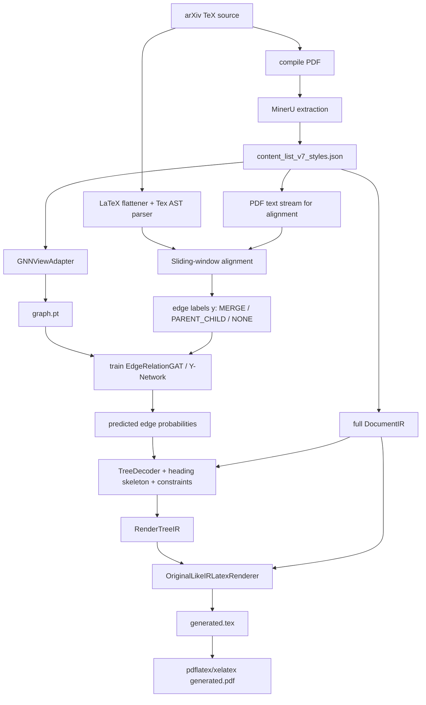
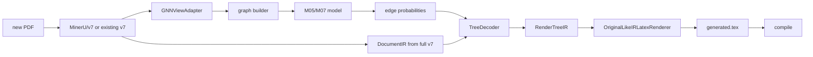

# PDF2LaTeX-NN 完整架构与设计说明

**最后更新**：2026-05-18

本文是项目的完整架构记录。它把 README、schema 文档、labeling 文档、ablation 说明和代码实现中分散的设计决策、数据流、判断规则、模型接口、评估指标和代码地图集中在一处。

项目有两个目标：

1. 构建一个可训练的关系模型，从 PDF 视觉事实和 TeX 派生监督中学习文档结构。
2. 使用预测关系和完整视觉事实层，重建可编译且结构忠实的 LaTeX。

本项目不是普通 OCR，也不是纯端到端语言模型。MinerU 提供强 PDF 感知，本项目在其基础上增加结构推理、关系学习、确定性安全约束和 LaTeX 生成器。

## 0. 摘要

当前维护系统只使用 v7。

```text
compiled PDF + matching TeX source
  -> MinerU extraction
  -> v7 full visual fact layer
  -> GNNViewAdapter graph-visible view
  -> graph.pt feature tensor
  -> TeX AST alignment labels
  -> GATv2 / Y-Network relation model
  -> constrained decoder / heading skeleton / float grouping
  -> full v7 IR generator
  -> generated .tex and .pdf
```

最重要的架构拆分是：

```text
full v7 JSON = 供生成器使用的完整事实层
GNN view     = 供关系学习使用的过滤/代理视图
```

不要因为某些视觉事实不适合 GNN message passing，就删除、改写或标记为噪声。标题、作者、图片、表格、caption、references、footnotes、页眉页脚和 style spans 都保留在 v7 中。GNN 使用 `GNNViewAdapter` 构建的独立视图。

当前模型/数据家族：

```text
locked baseline/results:
  tag: v7_registry_adapteraware_20260515_181724
  raw edge_attr_dim: 22
  main checkpoint family: M05/M07 Y-network results
  keep all reports/checkpoints/generated PDFs

active experimental rebuild:
  tag: v7_floatproxy_adapter_20260516_205926
  raw edge_attr_dim: 26
  figure/table/algorithm enter GNN as float proxies
  raw table body / figure OCR do not enter SciBERT text channel
```

## 1. 设计哲学

### 1.1 让 MinerU 负责什么

MinerU 负责低层视觉提取：

- text blocks
- titles
- equations
- tables
- figures/images
- layout boxes
- OCR text
- content list ordering and page coordinates

我们不替代 MinerU OCR 或公式/表格检测。项目假设 MinerU 是感知基础，重点改进结构、阅读顺序、关系推理和 LaTeX 重建。

### 1.2 哪些不能盲信

MinerU 很强，但不是完美的：

- mixed single/two-column 页面 reading order 会失败
- 页眉、页脚、页码可能被当成正文
- inline math 可能被拆开或当成普通文本 OCR
- figure/table 可能被切成多个框
- caption 可能和 paragraph 混淆
- title/author block 可能污染 column detection

因此 v7 增加 cleanup、style enrichment、layout roles、duplicate/noise marking 和 reading-flow metadata。但逻辑合并不能太早做。跨页段落合并属于 decoder/generator。

### 1.3 为什么使用 GNN

模型预测局部图关系：

```text
MERGE        physical continuation / paragraph stitching
PARENT_CHILD structural attachment / hierarchy
NONE         no structural relation
```

GNN 不单独负责重建整篇文档。它学习规则难以覆盖的模糊关系，再由确定性约束防止物理不可能的结构。

### 1.4 为什么仍然需要规则

有些文档事实更适合确定性处理：

- heading parentage 应由全局 heading stack 决定
- section scope 应遵循 reading order
- 真正的 page furniture 不应进入 body graph
- cross-column gutter barrier 应阻止不可能的 merge
- floats 和 captions 应先做几何分组再渲染
- references 和 appendix 需要 section-tail 策略

目标拆分：

```text
Rules: global outline, hard physical constraints, safety gates
GNN: local continuation and attachment evidence
Renderer: faithful LaTeX surface from full v7 facts
```

## 2. 系统流程图



## 3. 代码地图

### 3.1 感知层

```text
src/perception/
```

| 文件 | 职责 |
| --- | --- |
| `schema.py` | 稳定特征 schema、block enum、tensor 字段名。 |
| `content_resolver.py` | 从显式 MinerU/v7 roots 中有界选择当前 full v7 content JSON。 |
| `reading_order.py` | v7 reading-order metadata、TOC/noise helpers、duplicate continuation。 |
| `xy_cut.py` | reading-order 排序辅助和 band/column order 工具。 |
| `style_spans.py` | PyMuPDF span 提取、style state merge、font/bold/italic/math/code flags。 |
| `layout_probes.py` | header/footer/footnote/TOC/front matter 等 layout-role 探针。 |
| `title_features.py` | 编号和 heading token 探针。 |
| `gnn_view_adapter.py` | 将完整 v7 fact layer 转换为 GNN graph-visible view。 |

### 3.2 IR 层

```text
src/ir/
```

| 文件 | 职责 |
| --- | --- |
| `schema.py` | DocumentIR、DocumentNode、RenderTreeIR、RenderRole、metadata。 |
| `serialization.py` | IR JSON 序列化。 |
| `validators.py` | IR 校验。 |

### 3.3 Adapter 层

```text
src/adapters/
```

| 文件 | 职责 |
| --- | --- |
| `mineru_v7_document_ir.py` | 将完整 MinerU v7 styled JSON 转换为 DocumentIR。 |

### 3.4 Reasoning 层

```text
src/reasoning/
```

| 文件 | 职责 |
| --- | --- |
| `graph_builder.py` | 从 GNN view 构建 PyG `Data`：节点特征、边特征、候选边和 masks。 |
| `gnn_model.py` | `FeatureProjector`、`EdgeRelationGAT`、Y-network、message mask、merge gate。 |
| `training.py` | 训练工具。 |
| `label_generator.py` | AlignmentLabeler 和边标签生成。 |
| `tex_ast_builder.py` | TeX AST 提取。 |
| `latex_flattener.py` | 注释剥离、input/include 展平、bbl 注入、宏处理、数学屏蔽。 |
| `tex_relation_labeler.py` | TeX path relation labeling。 |
| `postprocess.py` | TreeDecoder、merge contraction、约束、relation-to-render tree bridge。 |
| `prediction_io.py` | 将 raw GNN edge logits/probabilities 写成可审计的 `PredictedRelations` JSON sidecar。 |
| `heading_skeleton.py` | heading evidence 和文档局部 heading style profile。 |
| `layout_state_machine.py` | layout state-machine parsing helpers。 |

### 3.5 Generation 层

```text
src/generation/
```

| 文件 | 职责 |
| --- | --- |
| `render_surface.py` | 规范公共渲染入口。 |
| `ir_renderer.py` | Original-like IR renderer 和文档级渲染逻辑。 |
| `ir_renderers/` | Registry 风格 role renderer：headings、text、math、figures、tables、lists、references、notes、front matter。 |
| `style_profile.py` | 全局页面/风格 profile：纸张、边距、栏、字体、页眉页脚。 |
| `table_assets.py` | 表格/图片 crop fallback assets、grouping、bbox union、asset paths。 |
| `citations.py` | Citation/reference 解析和修复。 |
| `front_matter.py` | 标题/作者/摘要辅助。 |
| `source_float_layout.py` | 可选的源 TeX float placement hints。 |
| `font_resolver.py` | 字体映射和 fontspec 辅助。 |
| `latex_helpers.py` | IR renderer 使用的转义、数学、列表、浮动体、算法 helper。 |
| `latex_renderer.py` | 历史测试用的已废弃独立 tree renderer，不是生产渲染表面。 |

### 3.6 Evaluation 层

```text
src/evaluation/
tools/
```

| 文件 | 职责 |
| --- | --- |
| `comparison_structure.py` | 将 LaTeX/Markdown 转成中立 comparison structure。 |
| `structure_metrics.py` | heading、reading order、段落边界/文本覆盖、section attachment、references、float-caption 指标。 |
| `compile_eval.py` | 编译成功率评估。 |
| `visual_qa.py` | 视觉 QA 辅助。 |
| `tools/convert_latex_to_comparison.py` | LaTeX 转 comparison JSON。 |
| `tools/convert_markdown_to_comparison.py` | Markdown/Nougat MMD 转 comparison JSON。 |
| `tools/evaluate_comparison_structure.py` | 结构指标 CLI。 |
| `tools/evaluate_rendered_output.py` | 编译和页面布局相似度 CLI。 |
| `tools/visualize_graph_labels.py` | 在原 PDF 页面上绘制 bbox 和 MERGE/PARENT 标签。 |
| `tools/profile_candidate_edge_recall.py` | candidate edge oracle recall 分析。 |
| `tools/audit_labeled_manifest.py` | 数据集质量审计。 |
| `tools/profile_merge_hard_cases.py` | MERGE hard-case 分析。 |

### 3.7 Pipeline 脚本

```text
scripts/pipeline/
```

| 脚本 | 职责 |
| --- | --- |
| `build_v7_dataset_staged.py` | 从 source/PDF 物料进行分阶段端到端数据生产。 |
| `run_current_v7_rebuild_relabel.sh` | 对已有 v7 JSON 进行当前 rebuild/relabel 编排。 |
| `rebuild_graphs_from_manifest.py` | 从 v7 content 重建 graph `.pt`。 |
| `relabel_manifest.py` | 给一批 graph/content/TeX pair 生成标签。 |
| `train_edge_gnn_full.py` | 完整关系模型训练，支持 CE/Focal/OHEM/threshold calibration。 |
| `prepare_ablation_suite.py` | 生成 ablation 运行命令。 |
| `summarize_ablation_results.py` | 汇总 ablation 输出。 |
| `run_e2e_inference.py` | 批量/单文档 E2E 推理到 TeX/PDF。 |
| `batch_visual_qa_inference.py` | E2E 视觉 QA 批处理。 |
| `step5_generate_tex.py` | 单文档推理/生成入口。 |
| `run_nougat_comparison.py` | Nougat 对比运行器。 |
| `download_nougat_checkpoint.py` | Nougat checkpoint 下载辅助。 |
| `filter_split_manifest.py` | 质量过滤和文档级切分。 |
| `clean_author_bio_merges_manifest.py` | 清理 author biography/backmatter 的 MERGE 污染。 |
| `calibrate_edge_thresholds.py` | 验证集阈值搜索。 |
| `refresh_graph_edges_from_manifest.py` | 不重跑 MinerU，刷新 edge topology/features。 |
| `augment_edge_punctuation_features.py` | 历史 punctuation feature augmentation。 |

## 4. 数据产物与合约

### 4.1 完整 v7 事实层

文件模式：

```text
content_list_v7_styles.json
```

用途：

- 完整 PDF 观察层
- generator 输入
- bbox、page、style span、layout role 和视觉事实来源

必须保留：

- body text
- headings
- title/authors/affiliations/abstract
- figures、tables、algorithms、captions
- references
- footnotes、margin notes
- header/footer/page number candidates
- raw bbox and page size
- style spans from PyMuPDF
- layout layer and role metadata

不应该做：

- 跨页段落合并
- 删除有用 metadata
- 为了 GNN 方便把 figures/tables 标成 noise
- 改写 title/author/front matter

### 4.2 GNN View

构建者：

```text
src/perception/gnn_view_adapter.py
```

返回：

```text
gnn_items
gnn_to_v7_index
gnn_to_v7_id
gnn_to_v7_ids
v7_index_to_gnn_idx
v7_id_to_gnn_idx
excluded_items_summary
```

当前策略：

| 源节点 | GNN view 策略 | Generator 策略 |
| --- | --- | --- |
| body text | include | render |
| headings | 如果是正文 heading 则 include | 通过 heading skeleton 渲染 |
| metadata title/authors/affiliation | 默认 exclude | 通过 front matter 渲染 |
| abstract | 通常不进入 body GNN | 作为 abstract/front-matter 渲染 |
| header/footer/page number | exclude | 只用于全局 page-style profile |
| footnote/margin note | exclude from body GNN | 通过 note renderer 渲染 |
| figure/table/algorithm | 实验路径中作为 float proxy include | crop fallback 或结构化表面渲染 |
| caption | 合适时作为 float 语义 proxy include | 跟随 float 渲染 |
| raw table body / figure OCR | 不嵌入为普通文本 | 仅用于 crop/table fallback |
| TOC | exclude | 可选渲染目录，不作为正文 |
| duplicate shadow/no_render | exclude | 不渲染 |

### 4.3 Graph `.pt`

图文件是 PyTorch Geometric `Data` 对象：

```text
Data(
  x=[N, node_dim],
  edge_index=[2, E],
  edge_attr=[E, edge_dim],
  y=[E],
  message_edge_mask=[E],
  merge_candidate_mask=[E],
  node_records=[N records],
  gnn_to_v7_id=[N],
  gnn_to_v7_ids=[N list],
  v7_source_path=...,
  feature_schema=...,
  edge_attr_schema=...
)
```

当前维度：

```text
locked baseline:
  edge_attr_dim = 22

float-proxy experimental path:
  edge_attr_dim = 26
```

节点维度由 schema 字段组合而成，添加节点特征组时会变化。当前 float-proxy rebuild 的 setup 为：

```text
node_dim = 832
edge_dim = 26
```

## 5. v7 前端处理

### 5.1 MinerU 阶段

输入：

```text
compiled PDF
```

输出：

```text
MinerU content list / middle outputs
```

MinerU 负责 OCR/layout/formula/table/figure detection。我们保留其输出作为感知基础。

### 5.2 v7 转换与样式增强

相关文件：

```text
scripts/pipeline/step1_build_content_v7.py
scripts/pipeline/step1_enrich_content_styles.py
src/perception/style_spans.py
src/adapters/mineru_v7_document_ir.py
```

主要增强：

- stable node ids
- page and bbox normalization
- reading order and global order metadata
- layout layer and role detection
- PyMuPDF style spans
- font size、bold、italic、inline math、inline code ratios
- list marker probes
- title numbering features
- duplicate-contained continuation detection
- TOC/header/footer/footnote/page number candidates
- float/table/figure grouping metadata

### 5.3 Reading Order

项目尝试过多种排序策略。当前生产规则：

```text
v7 保留 reading-flow metadata；
graph features 使用该 flow；
renderer 按稳定 reading order 排序 siblings；
global structure 可由 heading skeleton 和 decoder constraints 修正。
```

历史说明：

- v2 最接近原始 MinerU 输出。
- v3/v4/v5 包含实验性段落合并，不是生产路径。
- v7 移除了过早的跨段落合并，强调保留事实。
- 后续修复加入 band/column awareness、state-machine parsing 和 front-matter/noise 分离。

### 5.4 Noise 与 Metadata

Noise 只是真正的页面家具或重复项：

- repeated page headers
- repeated page footers
- page numbers
- 不需要作为正文结构的 TOC entries
- watermark-like fragments
- duplicate shadows / no-render OCR duplicates

Metadata 不是 noise：

- paper title
- authors
- affiliations
- emails
- abstract

Metadata 默认不进入 body GNN，但保留给 generator。

### 5.5 OCR 碎片清理

常见问题：

```text
y p p p g
g()
stray small symbols before a paragraph
```

当前策略：

- 检测正文附近极短、低语义、字母分裂的碎片
- 标为 duplicate_shadow/no_render 或排除出 GNN
- 保留原始 v7 记录供调试追踪
- 不让这些碎片进入 generator 输出

这是针对 MinerU OCR 边缘错误的防御层。

## 6. 特征工程

### 6.1 节点特征组

定义于：

```text
src/perception/schema.py
src/reasoning/graph_builder.py
```

节点特征拼接：

```text
SciBERT semantic embedding
type one-hot
geometry anchors
scroll geometry
derived statistics
style statistics
sinusoidal sequence position
column one-hot
title structure probes
layout layer one-hot
flow context features
```

主要 schema 字段：

```text
SCIBERT_DIM = 768

FEATURE_TYPE_VOCAB:
  text, title, equation, table, figure, algorithm, list, code, reference, other

GEOMETRY_FIELDS:
  x_start_local, y_start_page, x_end_local, y_end_page

SCROLL_GEOMETRY_FIELDS:
  norm_width_local
  norm_width_page
  norm_height_font
  norm_pseudo_y
  norm_index

DERIVED_STAT_FIELDS:
  macro_position
  aspect_ratio
  text_density

STYLE_STAT_FIELDS:
  baseline_font_size_norm
  font_size_vs_doc_body
  bold_char_ratio
  italic_char_ratio
  inline_math_char_ratio
  inline_code_char_ratio

SEQUENCE_POSITION_FIELDS:
  16-dimensional sinusoidal reading-order encoding

COLUMN_FEATURE_FIELDS:
  column_left
  column_right
  column_full_or_single

TITLE_STRUCTURE_FIELDS:
  relative_font_size
  is_h1_pattern
  is_h2_pattern

LAYOUT_LAYER_FIELDS:
  main_text_flow
  math_layer
  float_layer
  annotation_layer
  metadata_layer
  noise_layer
  other_layer

FLOW_CONTEXT_FIELDS:
  band_position
  band_local_order
  band_column_left
  band_column_right
  band_column_full
  is_band_boundary
  is_main_flow_candidate
```

### 6.2 SciBERT 处理

模型：

```text
allenai/scibert_scivocab_uncased
```

原始 graph 保存完整 768 维 embedding。模型侧 `FeatureProjector` 执行：

```text
raw SciBERT 768
  -> L2 normalize
  -> Linear(768, 64)
  -> ReLU
  -> Dropout
  -> L2 normalize again
```

原因：

- 降低语义特征对几何的压制
- 降低 topic/domain overfitting
- 让语义通道更偏结构，而不是词汇记忆
- 为边特征保留相对语义连续性

### 6.3 几何与 Scroll 坐标

系统同时使用局部和全局几何：

```text
local x normalization:
  x relative to the current column frame

page width normalization:
  width / physical page width

pseudo-y / scroll-y:
  converts page/column flow into a long vertical scroll coordinate
```

目标是减少以下逻辑相邻位置在物理坐标中的假远距离：

```text
left-column bottom -> right-column top
```

并让混合单双栏页面在更合理的一维流中表达。

### 6.4 边特征组

当前 `EDGE_ATTR_FIELDS`：

```text
semantic_cosine
delta_y_gap
delta_x_left
left_alignment
center_distance
font_size_delta
bold_to_regular
line_height_ratio
y_overlap_ratio
has_x_gutter
index_delta_bin_adjacent
index_delta_bin_skip_one
index_delta_bin_near
index_delta_bin_far
index_delta_bin_reverse
source_ends_with_terminal_punctuation
source_ends_with_hyphen
same_layout_layer
same_layout_band
same_band_column
band_order_delta
crosses_band_boundary
is_float_skip_edge
has_float_between
has_figure_between
has_table_between
```

重要边特征含义：

- `semantic_cosine`：SciBERT 空间连续性。
- `delta_y_gap`、`delta_x_left`、`center_distance`：物理关系。
- `y_overlap_ratio`、`has_x_gutter`：跨栏壁垒。
- index delta bins：序列关系，但避免过拟合具体标量。
- punctuation probes：source 是否以结束标点或连字符结束。
- layout/band features：局部 column/band 兼容性。
- float skip features：围绕表格/图片的候选延续关系。

### 6.5 候选边拓扑

候选边由 `build_candidate_edge_pairs` 构建。

当前来源：

```text
sequential_forced
sequential
spatial_down
spatial_right
same_column_long_sight
float_skip
scope_anchor
list_run_scope
list_intro_scope
```

关键参数：

```text
sequential_window = 15
spatial_k = 3
long_sight_window = 40
scope_anchor_window = 160
float_skip_window = 40
bidirectional_edges = True
```

Candidate edge recall 是质量门。如果真实 MERGE/PARENT 边不在 `edge_index` 中，模型不可能学习或预测它们。

## 7. GNNViewAdapter 与 Float Proxy 设计

### 7.1 原始问题

早期设计考虑完全把 figures/tables 排除出 GNN 输入。这能保护文本特征，但会产生两个问题：

1. 如果 graph nodes 与 v7 nodes 分裂太大，索引映射会变脆弱。
2. 跨越 floats 的长段落延续会失去显式障碍物上下文。

### 7.2 当前实验策略

Figure/table/algorithm 节点以 float proxy 进入图：

```text
float proxy keeps:
  bbox
  page
  order
  type
  v7 mapping

float proxy replaces semantic text with:
  caption text if available
  otherwise [FIGURE] / [TABLE] / [ALGORITHM]
```

禁止：

```text
raw table body -> SciBERT paragraph text
raw figure OCR -> paragraph embedding
float node -> normal MERGE with text
float node -> unrestricted message passing into text
```

### 7.3 Masks

两个关键 mask：

```text
message_edge_mask:
  限制哪些边参与 GAT message passing

merge_candidate_mask:
  阻止物理/语义不可能边的 MERGE logit
```

分类器仍然看到完整候选边集合。受限的只是传播和 MERGE 资格。

## 8. TeX 真值生成

### 8.1 为什么生成标签

训练需要 ground-truth edge labels。它们来自配对 TeX 源码，而不是人工标注。

推理时不使用 TeX。模型只看 PDF 派生图特征。

### 8.2 TeX 展平

实现于：

```text
src/reasoning/latex_flattener.py
```

流水线：

```text
strip comments
recursively expand \input / \include
inject .bbl if available
expand simple zero-argument macros
mask dangerous math environments for parsing when needed
ignore visual-only commands
raise on poison drawing environments when necessary
```

重要规则：

- 先剥注释，避免注释掉的 `\input{old}` 被加载。
- 跳过 `\includegraphics`、`\vspace`、`\label`、`\resizebox` 等视觉命令。
- 未知包裹宏如果包含文本，则剥壳保留内部文本。
- 未知环境默认降级为 paragraph 容器，除非是毒性环境。
- TikZ/PGF 类绘图环境可触发数据丢弃。

### 8.3 TeX AST 节点

支持节点类型：

```text
section
paragraph
equation_display
list_container
list_item
figure_caption
table_caption
reference
```

每个节点记录：

```text
tex_id
node_type
clean_text
parent_id
path_ids
source span
```

Path encoding 支持近似 O(1) 的关系判断：

```text
same tex node           -> MERGE candidate
parent path relation    -> PARENT_CHILD
otherwise               -> NONE
```

### 8.4 PDF-to-TeX 对齐

实现于：

```text
src/reasoning/label_generator.py
```

核心方法：

```text
clean TeX text and PDF text
scan both streams in reading order
use sliding window accumulation
match by fuzzy similarity / Levenshtein-style score
allow equation/float blind alignment with local anchors
write mapping tex_id -> [gnn node indexes]
```

重要对齐策略：

- 使用和 graph building 相同的 `GNNViewAdapter`。
- 标签生成在 GNN nodes 上进行，不在完整 v7 nodes 上直接进行。
- 保留映射回完整 v7。
- metadata/front matter 和 expected page furniture 不污染 orphan rate。
- float nodes 使用弱/锚点对齐，不当普通文本段落处理。

### 8.5 标签规则

标签：

```text
MERGE        = 0
PARENT_CHILD = 1
NONE         = 2
```

`SIBLING` 已废弃并折叠进 `NONE`。

MERGE：

```text
if u and v map to the same TeX node
and types are merge-compatible
and neither endpoint is float/table/figure/equation/code
then MERGE
else not MERGE
```

PARENT_CHILD：

```text
if TeX parent node contains child node
then parent first mapped bbox -> child first mapped bbox is PARENT_CHILD
```

视觉层级 fallback：

- 当 TeX parser 无法表达 run-in headings 或 layout-only headings 时，visual heading hierarchy 可以提供 parent candidates。

质量门：

```text
orphan ratio
unmapped TeX ratio
isolated node ratio
candidate edge recall
minimum aligned nodes
section presence
poison layout constructs
```

## 9. 模型架构

### 9.1 FeatureProjector

原始 graph `x` 不直接送入 GAT，而是先投影：

```text
semantic tower:
  768 SciBERT -> L2 -> Linear(64) -> ReLU -> Dropout -> L2

layout tower:
  type + geometry + stats + style + flow -> Linear(32) -> ReLU -> LayerNorm

projected node:
  semantic_64 + layout_32
```

### 9.2 EdgeRelationGAT

模型使用带边属性的 GATv2：

```text
GATv2Conv(..., edge_dim=effective_edge_dim)
```

Message passing 模式：

```text
all edges
type-aware message_edge_mask
no message passing
```

### 9.3 深层边预测器

边分类器构造有方向的 pair features：

```text
concat([Hu, Hv, Hu - Hv, Hu * Hv, Euv])
```

这让 PARENT_CHILD 具备反对称性。如果 `A -> B` 是 parent-child，`B -> A` 不会自动也是 parent-child。

### 9.4 Y-Network

Ablation 的关键结论：

```text
message passing helps PARENT_CHILD
message passing can pollute MERGE
```

因此 Y-network 分离两个 head：

```text
MERGE head:
  raw projected node pair features, bypassing GNN propagation

PARENT/NONE head:
  propagated GAT states
```

这样 MERGE 保留局部段落边界证据，同时 PARENT_CHILD 受益于全局上下文。

### 9.5 Hard Merge Gate

即使模型给出高 MERGE 分数，物理 gate 也可以抑制 MERGE logit：

- list bullet barrier
- cross-column gutter barrier
- title/text incompatibility
- float/table/figure/equation incompatibility
- author biography/backmatter exclusions
- causality/order constraints
- excessive distance constraints

### 9.6 Gaussian Edge Feature

M07 添加 proximity 边特征：

```text
gaussian_proximity = exp(-distance^2 / (2 sigma^2))
```

这是模型可见提示，不是硬 attention kernel。它帮助传播分支判断物理接近性。

## 10. Decoder 与结构约束

### 10.1 TreeDecoder 职责

主要实现：

```text
src/reasoning/postprocess.py
```

职责：

- 读取模型 logits / `predicted_relations.json` 中的 raw edge probabilities
- threshold probabilities
- contract MERGE components
- enforce can_merge barriers
- route predicted GNN edges back to v7 ids
- build heading skeleton if enabled
- restrict relations within section scope
- group references and appendix
- pass full v7 facts to generator

### 10.2 Merge Contraction

MERGE 边形成 connected components。每个 component 变成 supernode：

```text
texts are joined
bboxes are preserved/unioned
source node ids are retained
edge endpoints are rerouted
self loops are removed
```

MERGE 禁止跨越：

- section boundaries
- title nodes
- target list markers
- float/table/figure/equation barriers
- Y 重叠且 X gap 大的 cross-column gutter
- 不允许的物理倒序 parent/child

### 10.3 Heading Skeleton

Heading skeleton 是围绕学习式 GNN 关系模型的 decoder prior 和安全机制。它不重新定义 GNN 任务，也不替代原来的三分类关系预测设计。

Heading stack 模式：

```text
collect heading evidence
learn document-local heading style
scan nodes in reading order
maintain active heading stack
provide outline priors and section-scope safety gates
consume GNN MERGE / PARENT_CHILD / NONE probabilities under constraints
```

`PredictedRelations` sidecar 用于审计 raw per-edge 模型输出：

```text
edge_logits.pt
  -> predicted_relations.json
     - edge id 和 source/target graph index
     - MERGE/PARENT_CHILD/NONE probabilities
     - raw argmax label
     - threshold config
```

最终渲染结构不是 raw argmax，而是在 merge contraction、heading-stack scope、relation barrier 和 exact graph-to-v7 bridge 之后得到。

Heading evidence 包含：

- MinerU title/type
- layout role
- relative font size
- bold ratio
- isolated line/band boundary
- vertical gaps
- numbering style
- text length
- 对 caption、reference、footnote、header、formula 的负信号

Stack 规则：

```text
when a heading of level L appears:
  pop stack while top.level >= L
  attach heading to current top
  push heading

non-heading body:
  attach to current active heading
```

防止：

- text 吞掉 heading
- title 挂在 paragraph 下面
- 已有 section 时 subsection 直接挂 root
- 跨页 section scope 丢失

### 10.4 Float 与 Caption Grouping

Float 处理结合：

- v7 float metadata
- bbox proximity
- caption regex
- figure/table number identity
- same-page grouping
- 可选 source TeX float layout hints

规则：

- figures/tables 不是普通 paragraphs。
- 匹配 `Figure/Fig./Table/Algorithm N` 的 caption 从正文中抽离。
- 相邻 figure fragments 有相同/兼容 caption 时可合并。
- subfigure caption 不总是结构化重建，优先保留大 caption。
- wide floats 使用 `figure*` / `table*` 或临时单栏行为。
- small floats 尽量留在当前栏。
- 精确位置重要时，使用 `[H]`/placement hardening 限制 LaTeX float 自由漂移。

### 10.5 References 与 Appendix

References：

- reference items 保留为 bibliography entries。
- 生成 `\bibitem` 时去掉原始 OCR label，例如 `[1]`。
- 若 citation resolution 存在，可把 marker 替换为 `\cite{...}`。
- reference column mode 基于 reference item boxes 判断，而不是全文模式。

Appendix：

- references 后的 appendix 作为独立 scope。
- column mode 根据 appendix subtree bboxes 判断。
- appendix 可单栏或双栏，不直接继承 main body / references。

### 10.6 Footnotes 与页面家具

Header/footer：

- 跨页统计检测
- 稳定时全局渲染
- 页码优先使用生成 counter，而不是 OCR footer text

Footnotes/margin notes：

- 排除出 body GNN
- 保留在完整 v7
- generator 通过 marker 或最近 body node 匹配 anchor
- 置信度足够时渲染为 `\footnote{...}` 或 note surface

## 11. Generator 架构

### 11.1 规范 Renderer

生产入口：

```text
src/generation/render_surface.py
OriginalLikeIRLatexRenderer
```

底层 LaTeX helper 模块：

```text
src/generation/latex_helpers.py
```

已废弃的独立 tree renderer：

```text
src/generation/latex_renderer.py
```

独立 tree renderer 不是生产路径。当前 E2E 脚本只暴露：

```text
--renderer ir
```

### 11.2 Registry Renderers

Generator 正在拆成 role-specific renderers：

```text
OriginalLikeIRLatexRenderer
  -> IRRendererRegistry
    -> FrontMatterRenderer
    -> HeadingRenderer
    -> TextRenderer
    -> MathRenderer
    -> FigureRenderer
    -> TableRenderer
    -> ListRenderer
    -> ReferenceRenderer
    -> NoteRenderer
```

共享数据：

```text
RenderContext
DocumentNodeRenderContext
StyleProfile
CitationResolution
CrossReferenceRegistry
```

### 11.3 全局 Style Profile

Style profile 估计：

- paper size: A4/letter-like geometry
- margins
- body font size
- title/heading font clusters
- front matter style
- abstract style
- one-column/two-column/mixed layout
- reference column mode
- header/footer/page number style

重要修正：

Column mode 应从正文判断，而不是作者块。作者块可能看起来像多栏，但不应让整篇论文进入双栏模式。

### 11.4 局部渲染规则

Text：

- 有 span 时按 bold/italic/code/math 渲染
- 保护 inline LaTeX math
- 避免把已知 LaTeX math command 当普通文本转义
- 清理 OCR shadows/no-render fragments

Math：

- 有 span/type evidence 时保护 inline math
- display equation 使用 equation/align/gather/multline fallback
- 极宽公式使用更安全环境/宽度处理
- equation number 尚未完全语义重建

Figures：

- 默认从原始 PDF 区域 crop fallback
- 必要时合并 fragments
- 按 bbox width ratio 决定栏内还是跨栏
- 有 caption/label 时自动生成

Tables：

- 默认 crop fallback，保证视觉可靠
- 安全时合并 fragments
- 宽表可以切到跨栏/单栏 float surface
- 当前不重点重建内部 cell semantics

References：

- bibliography fallback
- 无真实 key 时使用 `\bibitem{ref_i}`
- citation marker 可替换时替换

Front matter：

- title、authors、affiliation、abstract 来自完整 v7 metadata
- author block 重建是近似的，依赖模板和样式

## 12. 训练流水线

### 12.1 数据集创建

生产质量数据使用编译后的 source-PDF pair：

```text
arXiv source -> compile PDF -> MinerU -> v7 -> graph -> TeX labels
```

避免使用不同 arXiv revision 的官方 PDF 和 TeX 源进行训练。

### 12.2 重建/重标注已有 v7

入口：

```bash
TAG=<new_tag> \
INPUT_MANIFEST=<manifest.json> \
WORKERS=4 \
PYTHON_BIN=/root/miniconda3/envs/pdf2latex/bin/python \
EMBEDDING_DEVICE=cpu \
bash scripts/pipeline/run_current_v7_rebuild_relabel.sh
```

这不重跑 MinerU，只从已有 v7 content 重建 graph tensor 并生成 labels。

### 12.3 Train/Val/Test Split

必须文档级切分：

```text
never page-level split
```

原因：同一篇论文的页面共享模板、字体、边距和版式。页级切分会泄漏模板风格，导致验证分数虚高。

### 12.4 Loss 与类别不平衡

NONE 极度占优。项目测试过：

- Cross entropy
- Focal loss
- dynamic negative dropout
- OHEM hard negative mining
- threshold calibration

当前经验：

- 随机 negative dropout 会移除 hard negatives，可能伤害 precision
- OHEM 更合理
- validation threshold search 有用，但必须透明报告
- selection metrics 应强调 positive classes，尤其 MERGE

### 12.5 Thresholds

极端类别不平衡下，默认 argmax 不总是理想。可以在验证集搜索阈值：

```text
if P(MERGE) > tau_merge -> MERGE
elif P(PARENT_CHILD) > tau_parent -> PARENT_CHILD
else NONE
```

阈值校准不是数据造假，前提是：

- 只在 validation data 上选择
- test evaluation 前锁定
- 在实验配置中报告

## 13. Ablation 设计

核心 ablation 用来验证每个子系统是否有用。

| Ablation | 目的 |
| --- | --- |
| full / M05 / M07 | 主模型变体。 |
| old shared GAT | 比较 Y-network 和旧 GAT。 |
| no message passing | 检验 MERGE 是否更需要局部原始特征。 |
| no type-aware message mask | 检验 floats/tables/noise 传播污染。 |
| no v7 reading-flow correction | 检验 v7 layout-flow 修正贡献。 |
| Raw-MinerU-Flow | 使用原始 MinerU order 计算 flow/index/pseudo-y bins。 |
| no SciBERT | 检验语义贡献。 |
| no geometry | 检验物理布局贡献。 |
| no punctuation probes | 检验段落边界提示。 |
| no Gaussian edge feature | 检验 proximity feature。 |
| float-proxy adapter | 检验 figure/table/algorithm proxy 策略。 |

主研究假设：

```text
GNN relation reasoning improves document structure, but only when the graph view,
message passing, and decoder constraints prevent visual noise from polluting
paragraph and heading relations.
```

## 14. 评估指标

### 14.1 边级指标

模型训练用：

- MERGE precision/recall/F1
- PARENT_CHILD precision/recall/F1
- positive macro F1
- precision-oriented F0.5 variants
- confusion matrix
- class distribution
- candidate edge recall

由于 NONE 极度占优，不要依赖 overall accuracy。

### 14.2 标签质量指标

数据生产用：

- raw orphan ratio
- effective orphan ratio
- unmapped TeX ratio
- isolated node ratio
- expected orphan exemption count
- candidate edge recall
- label distribution
- failure reason summary

### 14.3 结构对比指标

中立 comparison structure 定义于：

```text
docs/comparison_structure_v1.md
src/evaluation/comparison_structure.py
src/evaluation/structure_metrics.py
```

指标：

```text
heading_tree_accuracy
reading_order_accuracy
strict_block_match
window_matching
paragraph_boundary_f1
paragraph_text_coverage_f1
paragraph_merge_f1  # 已废弃的兼容别名；不要作为独立指标汇报
section_attachment_f1
section_attachment_body_no_float_f1
section_attachment_oracle_heading_flow_f1
reference_section_completeness
float_caption_attachment_accuracy
generated_structure_validity
macro_structure_score
```

`strict_block_match` 保留原先严格的一对一块匹配口径。
`window_matching` 和 `paragraph_text_coverage_f1` 允许一个 gold 段落对应多个
生成段落，或多个 gold 段落对应一个生成段落，从而把“文本是否覆盖”和
“段落边界是否一致”分开评价。这些指标比较结构和内容覆盖，不比较精确字体
或 raw OCR。

### 14.4 渲染输出指标

针对生成 PDF：

- LaTeX compile success
- page count similarity
- ink bbox similarity
- horizontal/vertical density profile similarity
- manual hard-case visual QA

视觉 QA 重点：

- title/authors/abstract
- heading hierarchy
- body column mode
- table/figure/caption grouping
- references
- appendix
- inline/display math
- long-distance MERGE around floats

### 14.5 Nougat 对比

Nougat 输出 Markdown/MMD。我们通过中立结构层比较：

```text
our LaTeX -> comparison_structure_v1
Nougat MMD -> comparison_structure_v1
gold/source TeX -> comparison_structure_v1
```

我们不声称在 raw OCR 或公式识别上超过 Nougat。对比重点：

- heading tree
- reading order
- paragraph/list merge boundaries
- section attachment
- references
- 可观察的 float/caption structure
- 仅对我们的 LaTeX 适用的 compile/layout QA

## 15. End-To-End 推理流程



推理时：

- 不使用 TeX source
- 不生成 labels
- GNN 在 GNN-view indexes 上输出关系
- relation bridge 映射回 full v7 ids
- generator 使用 full v7 facts

## 16. 当前已知限制

### 16.1 MinerU/OCR 限制

- 偶发 OCR 碎片
- inline math 可能是 plain text
- figure 可能漏检或切开
- table 可能切开
- header/footer 可能被当正文
- 困难 mixed layout 中 reading order 可能错误

### 16.2 TeX Label 限制

- 非常规宏可能击穿 AST 提取
- source float position 可能与 PDF float position 不一致
- 复杂自定义 section command 可能降级
- TikZ/PGF 绘图会污染对齐
- author/front-matter layout 通常与源码语义脱节

### 16.3 GNN 限制

- MERGE 是极端长尾
- PARENT_CHILD 有方向性，容易受 noisy candidates 影响
- message passing 可能过平滑段落边界
- candidate edge recall 是硬上限
- GNN view 与 label view 一旦不一致，标签就失效

### 16.4 Generator 限制

- 还不能完全复刻期刊模板
- table cell 通常是 crop fallback，不是语义重建
- author block 是近似重建
- figure/table placement 仍是近似但在改进
- equation numbering 和 align/multline 保真度未完备
- bibliography key 和 author-year style 依赖 citation resolution，失败时 fallback

## 17. 什么时候重跑什么

### 17.1 需要重跑 MinerU

仅当改变：

- OCR backend
- MinerU version/backend
- image/table/formula detection
- PDF input set
- 依赖原始 MinerU 输出但未保存的 v7 extraction

### 17.2 不需要重跑 MinerU

只需 rebuild/relabel，当改变：

- GNNViewAdapter policy
- graph features
- edge topology
- label rules
- TeX alignment quality gates
- model feature schema

### 17.3 不需要 rebuild/relabel

只需重跑 E2E/generator，当改变：

- TreeDecoder constraints
- heading skeleton
- float/caption grouping
- references/appendix rendering
- style profile
- LaTeX renderer
- visual QA scripts

### 17.4 需要重新训练

当以下内容改变时需要重新训练：

- graph tensors
- edge labels
- node/edge feature dimensions
- model architecture
- loss/sampling strategy

## 18. 当前 Runbook

### 18.1 重建并重标注已有 v7

```bash
TAG=v7_floatproxy_adapter_$(date +%Y%m%d_%H%M%S) \
INPUT_MANIFEST=data/00_manifests/v7_layers_epigraph_20260514_0238_trainable_recall98.json \
WORKERS=4 \
PYTHON_BIN=/root/miniconda3/envs/pdf2latex/bin/python \
EMBEDDING_DEVICE=cpu \
bash scripts/pipeline/run_current_v7_rebuild_relabel.sh
```

监控：

```bash
tail -f logs/${TAG}_run.log
find data/06_graph_features/${TAG}_graphs -name "*.pt" | wc -l
find data/06_graph_features/${TAG}_labeled_graphs -name "*.pt" | wc -l
```

### 18.2 审计标签

```bash
python tools/audit_labeled_manifest.py \
  --manifest data/00_manifests/${TAG}_labeled.json \
  --graph-root data/06_graph_features/${TAG}_labeled_graphs \
  --output data/09_eval_reports/${TAG}_audit.json
```

### 18.3 Candidate Edge Recall

```bash
python tools/profile_candidate_edge_recall.py \
  --manifest data/00_manifests/${TAG}_labeled.json \
  --graph-root data/06_graph_features/${TAG}_labeled_graphs
```

### 18.4 训练

```bash
python scripts/pipeline/train_edge_gnn_full.py \
  --manifest data/00_manifests/${TAG}_labeled.json \
  --graph-root data/06_graph_features/${TAG}_labeled_graphs \
  --output-dir data/09_eval_reports/train_${TAG}
```

### 18.5 E2E Hard Cases

```bash
python scripts/pipeline/batch_visual_qa_inference.py \
  --manifest <hardcase_manifest.json> \
  --checkpoint <best_model.pth> \
  --renderer ir \
  --output-dir local_outputs/final_eval_YYYYMMDD/e2e/<tag>
```

### 18.6 Nougat 对比

```bash
python scripts/pipeline/run_nougat_comparison.py \
  --manifest <comparison_manifest.json> \
  --limit 20 \
  --output-dir data/09_eval_reports/nougat_smoke_<tag>
```

然后转换输出：

```bash
python tools/convert_latex_to_comparison.py --input ours.tex --output ours.json
python tools/convert_markdown_to_comparison.py --input nougat.mmd --output nougat.json
python tools/evaluate_comparison_structure.py --gold gold.json --pred ours.json --output ours_metrics.json
python tools/evaluate_comparison_structure.py --gold gold.json --pred nougat.json --output nougat_metrics.json
```

## 19. 按关注点划分的代码归属

### 数据准备

- `scripts/pipeline/step0_*`
- `scripts/pipeline/build_v7_dataset_staged.py`
- `scripts/pipeline/run_current_v7_rebuild_relabel.sh`
- `scripts/pipeline/rebuild_graphs_from_manifest.py`
- `scripts/pipeline/relabel_manifest.py`

### 特征合约

- `src/perception/schema.py`
- `docs/feature_schema_v0.md`
- `src/reasoning/graph_builder.py`
- `tests/test_graph_builder_features.py`

### GNN View 合约

- `src/perception/gnn_view_adapter.py`
- `tests/test_gnn_view_adapter.py`
- `docs/frontend_backend_contract_v1.md`

### Label 合约

- `src/reasoning/label_generator.py`
- `src/reasoning/tex_ast_builder.py`
- `src/reasoning/latex_flattener.py`
- `docs/ground_truth_labeling_v0.md`
- `tests/test_label_generator.py`
- `tests/test_alignment_labeler.py`

### 模型合约

- `src/reasoning/gnn_model.py`
- `scripts/pipeline/train_edge_gnn_full.py`
- `configs/ablation_matrix_v7_adapteraware_20260514_2109.json`
- `tests/test_graph_builder.py`
- `tests/test_v7_training_entrypoints.py`

### Decoder 合约

- `src/reasoning/postprocess.py`
- `src/reasoning/heading_skeleton.py`
- `src/reasoning/layout_state_machine.py`
- `tests/test_postprocess_renderer.py`

### Generator 合约

- `src/generation/render_surface.py`
- `src/generation/ir_renderer.py`
- `src/generation/ir_renderers/`
- `src/generation/style_profile.py`
- `src/generation/table_assets.py`
- `src/generation/citations.py`
- `tests/test_ir_renderer_registry.py`
- `tests/test_generation_style_citations.py`

### Evaluation 合约

- `src/evaluation/comparison_structure.py`
- `src/evaluation/structure_metrics.py`
- `tools/evaluate_comparison_structure.py`
- `tools/evaluate_rendered_output.py`
- `tests/test_structure_metrics.py`
- `tests/test_comparison_structure.py`

## 20. 测试策略

Unit tests 覆盖：

- v7 contract 拒绝旧 JSON
- style span merging 和 font probes
- reading order helpers
- GNN view adapter mapping 和 exclusion/proxy policy
- graph builder feature dimensions 和 masks
- label generation 和 alignment quality
- GNN model architecture 和 edge heads
- training utilities、OHEM、threshold calibration
- IR schema 和 renderer registry
- structure comparison metrics
- safe generator behavior

关键测试：

```text
tests/test_gnn_view_adapter.py
tests/test_graph_builder_features.py
tests/test_label_generator.py
tests/test_alignment_labeler.py
tests/test_v7_training_entrypoints.py
tests/test_ir_renderer_registry.py
tests/test_structure_metrics.py
tests/test_comparison_structure.py
```

当前 float-proxy 改动的远程 targeted smoke：

```text
pytest -q tests/test_gnn_view_adapter.py tests/test_graph_builder_features.py
```

## 21. 论文写作视角

项目可以描述为：

```text
A structure-aware PDF-to-LaTeX system that combines a mature document parser
(MinerU), document-local visual/layout features, TeX-derived weak supervision,
and a constrained graph relation model to recover logical document structure
and generate compilable LaTeX.
```

主要贡献：

1. v7 full fact layer 与解耦 GNN view。
2. TeX AST 到 PDF block alignment，用于自动关系标签。
3. 带 Y-network 和 type-aware propagation 的有向边关系模型。
4. Layout-aware edge features，包括 scroll-y、band/column context 和 float-skip features。
5. 确定性 heading skeleton 和物理安全约束。
6. Original-like IR renderer，支持 table/figure crop fallback、references、citations、notes、mixed-column 和 compile checks。
7. 用于和 Nougat 类 Markdown 系统比较的中立 comparison structure。

实验应强调：

- 关系模型相对启发式在模糊 MERGE/PARENT 边上有提升
- type-aware propagation 防止 float/table 污染
- v7 reading-flow features 改善 mixed layout
- generator 能编译并保留比 plain OCR/Markdown 更强的结构
- 对比重点是结构，不是 raw OCR 或 formula recognition

## 22. 术语表

| 术语 | 含义 |
| --- | --- |
| v7 | 当前完整 styled MinerU-derived fact layer。 |
| GNN view | 用于 graph tensors 的过滤/代理 node sequence。 |
| Float proxy | figure/table/algorithm 用 caption/placeholder 表示给 GNN。 |
| MERGE | 同一个逻辑文本单元被拆成多个视觉框。 |
| PARENT_CHILD | 逻辑层级或挂载关系。 |
| NONE | 无学习结构关系。 |
| Heading skeleton | 与 GNN parent-edge 概率共同使用的 deterministic outline prior 和安全约束。 |
| RenderTreeIR | Decoder 输出，供 IR renderer 使用。 |
| Comparison Structure | 用于比较我们的 LaTeX 和 Nougat Markdown 的中立结构 JSON。 |
| Candidate edge recall | true labels 出现在 graph candidate edges 中的比例。 |
| Effective orphan ratio | 排除 expected non-body visual nodes 后的 orphan ratio。 |

## 23. 不可违反规则

1. 不用 v3/v4/v5 JSON 训练。
2. 不删除旧 checkpoints、eval reports、manifests 或 E2E outputs。
3. 不从历史 config 文件名推断当前数据家族。
4. 除非 OCR/bbox/raw extraction 改变，否则不重跑 MinerU。
5. Generator 不得把缩减后的 GNN view 当作完整文档使用。
6. 推理时不使用 TeX source。
7. 不做 page-level train/val/test split。
8. 在极端 NONE 不平衡下，不单独报告 accuracy。
9. 不把 metadata 和 floats 在完整 v7 fact layer 中当 noise。
10. 不要把旧 `--renderer tree` 重新引入生产 E2E 脚本。
