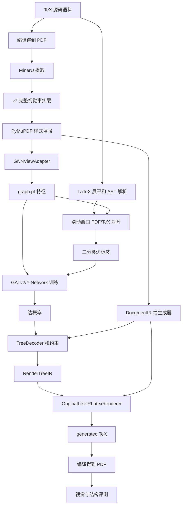

# 项目论文规划说明

**最后更新**：2026-05-18

这份文档面向论文写作，用来统一描述当前系统的任务定义、整体架构、数据接口、模型设计、生成器、评测协议和当前实验路线。它比普通 runbook 更长，适合后面拆成论文中的方法、实验、讨论和消融分析。

## 1. 任务定义

当前项目目标是：

```text
从渲染后的科研论文 PDF 中，重建可编译、版式感知、保留块级结构的 LaTeX。
```

当前项目**不是**：

```text
精确恢复作者原始 TeX 源码程序。
```

这个区别很关键。PDF 是渲染结果，而 TeX 是生成这个结果的程序。同一个 PDF 可以由许多不同的 TeX 源码生成。LaTeX 的 figure/table 浮动机制也会让图表在视觉位置上远离源码中写它的位置。因此，如果直接用作者原始 TeX AST 作为唯一标准，会不公平地惩罚 PDF-first 的系统。

我们真正要恢复的是：

```text
1. 块级语义组织
2. 阅读顺序和段落连续性
3. section/subsection/subsubsection 级别的标题层次
4. figure/table/caption/reference 结构
5. 页边距、单双栏、字体尺度、浮动体等版式线索
```

## 2. 核心论点

MinerU 是底层感知引擎。我们的贡献不是重新做 OCR，而是在 MinerU 之上完成结构推理和 LaTeX 重建：

```text
MinerU 提供视觉事实。
PyMuPDF 补充字体和 span 样式。
TeX 侧 labeler 生成关系监督。
GNN 预测不确定的文档关系。
Decoder 应用物理和结构约束。
Generator 生成可编译、版式感知的 LaTeX。
```

所以这个项目既不是纯 OCR，也不是纯语言模型，而是一个符号规则和神经网络结合的文档重建系统。

## 3. 端到端流程



## 4. 分层架构

### 4.1 PDF 前端

PDF 前端把 MinerU 和 PyMuPDF 的结果转换成标准 v7 事实层。

输入：

```text
编译后的 PDF
MinerU content / middle outputs
PyMuPDF 页面和 span 提取
```

输出：

```text
content_list_v7_styles.json
DocumentIR
GNNViewAdapter records
```

v7 层保留所有有用的观察事实：

```text
正文文本
标题和章节标题
作者、机构、摘要
图片、表格、算法、caption
references
脚注、边注
页眉、页脚、页码
OCR 文本和原始 bbox
字体 span 和样式统计
layout layer / layout role
阅读顺序元数据
```

关键原则：

```text
“不给 GNN 用”不等于“从 v7 删除”。
```

例如，页眉页脚可以不进 GNN，但仍然用于全局页面样式统计。figure/table 的原始 OCR 可以不作为语义 embedding，但图片裁剪和 caption 仍然给 generator 使用。

### 4.2 GNN View Adapter

GNN 不直接消费完整文档，而是消费 `src/perception/gnn_view_adapter.py` 生成的图可见视图。

Adapter 输出：

```text
gnn_items
gnn_to_v7_id
gnn_to_v7_ids
v7_id_to_gnn_idx
excluded_items_summary
```

这套映射在推理时必须使用。Generator 不能直接拿过滤后的 GNN view 渲染，而是必须回到完整 v7/DocumentIR，再把 GNN 预测关系桥接回 v7 id。

当前 float-proxy 策略：

```text
figure/table/algorithm 不作为正文节点
figure/table/algorithm 作为 float proxy 进入结构视图
caption 或 placeholder text 表示 float 语义
raw table body / raw figure OCR 不作为普通段落语义 embedding
float proxy 禁止 MERGE
float -> text message passing 被屏蔽
保留 skip-over-float candidate edge 以召回被浮动体隔断的段落连续关系
```

### 4.3 Graph Builder

`src/reasoning/graph_builder.py` 生成 PyTorch Geometric 的 `Data`。

主要字段：

```text
x                  节点特征
edge_index          有向候选边
edge_attr           有向边特征
y                   可选三分类标签
message_edge_mask   可以参与 message passing 的边
merge_candidate_mask
gnn_to_v7_id / gnn_to_v7_ids
feature_schema / edge_attr_schema
```

历史锁定基线：

```text
node_dim = 832
edge_dim = 22
```

当前 float-proxy 实验 schema：

```text
node_dim = 832
edge_dim = 26
```

论文和代码中都不要把维度写死。不同 schema 应该和 manifest/tag 绑定。

### 4.4 TeX 真值生成器

TeX 真值生成只用于训练数据生产，不用于推理。

主要代码：

```text
src/reasoning/latex_flattener.py
src/reasoning/tex_ast_builder.py
src/reasoning/label_generator.py
```

TeX 侧流程：

```text
1. 删除注释
2. 展平 \input 和 \include
3. 注入 .bbl
4. 处理简单宏
5. 对危险数学/绘图结构做屏蔽或降级
6. 提取有序结构序列
7. 将 TeX 节点与 PDF/GNN-view 节点对齐
8. 给 graph candidate edges 打标签
```

标签仍然是三类：

```text
MERGE        = 0
PARENT_CHILD = 1
NONE         = 2
```

没有 `SIBLING` 类。兄弟节点顺序由 v7 reading order 和 renderer 排序恢复。

### 4.5 GNN 关系模型

当前模型家族是 GATv2/Y-Network 混合结构。核心设计是：MERGE 不应该被 message passing 过度平滑，而 PARENT_CHILD 需要上下文传播。

结构概念：

```text
原始节点/边特征
  -> 特征投影
  -> type-aware message passing 分支服务结构上下文
  -> raw/direct pair 分支服务 MERGE
  -> 深层 edge predictor
  -> 三分类 logits
```

边预测器使用方向性项：

```text
concat([Hu, Hv, Hu-Hv, Hu*Hv, Euv])
```

这样 PARENT_CHILD 的方向可以被学习。A->B 可以是 PARENT_CHILD，而 B->A 必须可以是 NONE。

### 4.6 Decoder

Decoder 输入：

```text
full DocumentIR
GNN 边概率
GNN-to-v7 映射
layout role 和样式证据
```

Decoder 职责：

```text
1. 收缩 MERGE 连通分量
2. 应用物理壁垒和类型约束
3. 将 GNN 边关系桥接回 v7 id
4. 分组 float 和 caption
5. 构建或保护 heading skeleton
6. 生成 RenderTreeIR
```

当前标题方向：

```text
GNN 仍然是关系模型。
Heading stack 是 decoder prior 和安全约束。
Generator 不应该只依赖 GNN parent edge 恢复每一个 section scope。
```

### 4.7 Generator

公共入口：

```text
src/generation/render_surface.py
```

生产 renderer：

```text
OriginalLikeIRLatexRenderer
```

模块化 renderer：

```text
FrontMatterRenderer
HeadingRenderer
TextRenderer
MathRenderer / AlgorithmCodeRenderer
FigureRenderer
TableRenderer
ListRenderer
ReferenceRenderer
NoteRenderer
```

Generator 输入：

```text
完整 v7 转出的 DocumentIR
StyleProfile
Decoder 生成的 RenderTreeIR
CitationResolution
图片/表格裁剪资产
渲染配置
```

Generator 支持：

```text
front matter 和作者栏
abstract
section/subsection/subsubsection
paragraph 和 list
inline math 保护
display equation fallback
algorithm/code 截图或环境 fallback
figure/table crop fallback
caption 关联
references
footnote / margin note
header/footer/page style 统计
单双栏/混合栏近似
cross-reference 替换
```

## 5. 特征设计

### 5.1 语义特征

使用 SciBERT 提取科研文本语义。图中保存 768 维 embedding，模型内部投影和归一化。

作用：

```text
捕捉局部语义连续性
避免只用几何距离判断关系
辅助 MERGE 和 PARENT_CHILD
```

### 5.2 几何和版式特征

节点特征包含：

```text
局部栏坐标归一化
页面宽高归一化
pseudo-y / scroll order
全局 index
正弦阅读顺序编码
column one-hot
band/local flow context
相对字号
标题编号探针
```

### 5.3 边特征

边特征包含：

```text
语义 cosine
空间相对差
字体/字号差
y_overlap_ratio
has_x_gutter
index delta bins
终止标点探针
连字符结尾探针
类型对和 layout flags
float skip / intervening-float features
可选 Gaussian proximity
```

这些边是有方向的，`u -> v` 和 `v -> u` 的特征和标签都可以不同。

## 6. 评测协议

### 6.1 GNN 边指标

主要看：

```text
MERGE precision / recall / F1
PARENT_CHILD precision / recall / F1
positive macro F1
threshold calibration
candidate edge recall
```

NONE 数量极大，不作为主指标。

### 6.2 结构指标

使用中立 comparison structure，而不是直接比较原始源码 AST。

主要指标：

```text
heading_tree_accuracy
reading_order_accuracy
paragraph_boundary_f1
paragraph_text_coverage_f1
section_attachment_body_no_float_f1
reference_section_completeness
float_caption_attachment_accuracy
generated_structure_validity
macro_structure_score
```

关键归一化：

```text
\paragraph / \subparagraph 作为 inline label
figure/table/caption 不进入 body section attachment
float visual slot 单独评价
paragraph 支持 many-to-one / one-to-many coverage 匹配
```

### 6.3 视觉与编译指标

Generator 需要额外看：

```text
compile_success_rate
layout_similarity
page_count_score
hard-case visual inspection
```

### 6.4 Nougat 对比

Nougat 是强 markup-oriented 科研文档转录 baseline。它不是完整 layout-preserving LaTeX reconstruction 系统。

共享对比：

```text
text coverage
heading tree
reading order
paragraph boundary / coverage
references
caption/float structure
```

我们独有或更相关：

```text
可编译 LaTeX
layout similarity
float crop slots
page-style reconstruction
```

## 7. 当前实验轨道

### 7.1 锁定历史基线

```text
tag: v7_registry_adapteraware_20260515_181724
edge_attr_dim: 22
主要历史模型: M05/M07
状态: 保留用于回退和论文对比
```

### 7.2 当前 float-proxy 轨道

```text
tag: v7_floatproxy_adapter_20260516_205926
edge_attr_dim: 26
trainable docs: 1829
状态: 当前论文实验轨道
```

当前完整评测套件：

```text
scripts/pipeline/run_current_full_eval_suite.py
scripts/pipeline/collect_current_eval_results.py
configs/ablation_matrix_current.json
```

它会运行：

```text
1. current ablation matrix
2. ablation summary
3. current E2E generator evaluation
4. Nougat paired comparison
5. rollup report generation
```

## 8. 论文贡献候选

可以提炼成：

```text
1. 一个基于 full visual facts、filtered graph view、decoupled IR generator 的 layout-aware PDF-to-LaTeX pipeline。

2. 一个 TeX-derived 自动监督流程，用源 TeX 和 PDF block 对齐生成 GNN 边标签，减少人工标注需求。

3. 一个 GATv2/Y-Network 关系模型，通过 MERGE 直连分支和 type-aware message masking 平衡段落缝合与层级判断。

4. full-v7 / GNN-view 分离机制，让元数据、浮动体、脚注、references 可用于生成，同时避免污染 GNN message passing。

5. 一个分层评测协议，将文本覆盖、段落边界、标题树、body section attachment、float/caption、references、编译成功、版式相似度分开评价。
```

## 9. 已知风险

### 标题恢复

block-level section/subsection/subsubsection 可以恢复，但不同论文样式差异大。run-in heading 默认不强行进入 block heading tree。

### Float 语义

caption-float pairing 和视觉位置是可观察问题；float 属于哪个 section 是弱语义问题，受 TeX 浮动机制影响。

### OCR 噪声

MinerU 的 split letters 和段首奇怪符号需要 IR/generator 防御性过滤。这不是 GNN 的主要问题。

### 表格重建

当前以 crop fallback 为主，完整 cell-level LaTeX 表格重建属于后续单独任务。

### 期刊模板

Generator 根据观察到的页面统计做近似，不恢复真实 journal class 和自定义宏。

## 10. 如何读当前结果

GNN ablation 用来说明关系模型：

```text
MERGE F1
PARENT_CHILD F1
positive macro F1
SciBERT / geometry / flow / punctuation / message mask 的贡献
```

E2E hard cases 用来看工程质量：

```text
编译是否成功
视觉版式是否合理
authors / abstract / front matter
figures / tables / captions
references / appendix
OCR 碎片是否进入正文
```

Nougat paired comparison 用来定位外部基线：

```text
只比较共享结构能力
不声称精确恢复作者源码
单独报告我们的编译和版式指标
```

## 11. 推荐论文结构

```text
1. Introduction
   PDF-to-LaTeX 不只是 OCR；PDF 到 TeX 源码不是一一映射；定义 layout-aware reconstruction。

2. Related Work
   OCR/document parsing、科研文档转 markup、layout analysis、graph reasoning、PDF-to-LaTeX。

3. Method
   MinerU/PyMuPDF v7 fact layer、GNNViewAdapter、TeX-derived supervision、GNN、decoder、IR renderer。

4. Evaluation Protocol
   edge metrics、neutral comparison structure、visual/compile metrics、Nougat paired comparison。

5. Experiments
   ablation、E2E hard cases、Nougat comparison、failure analysis。

6. Discussion
   source-level TeX recovery 为什么不适合作为唯一目标；规则和 GNN 各自的作用；剩余问题。
```

